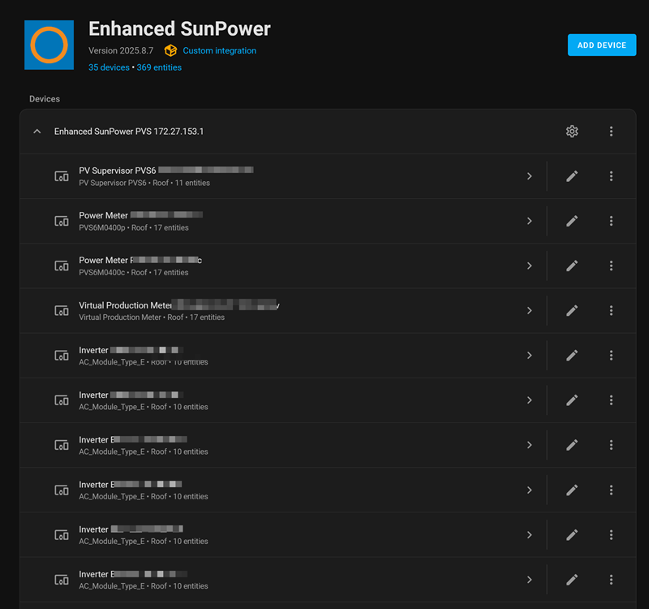
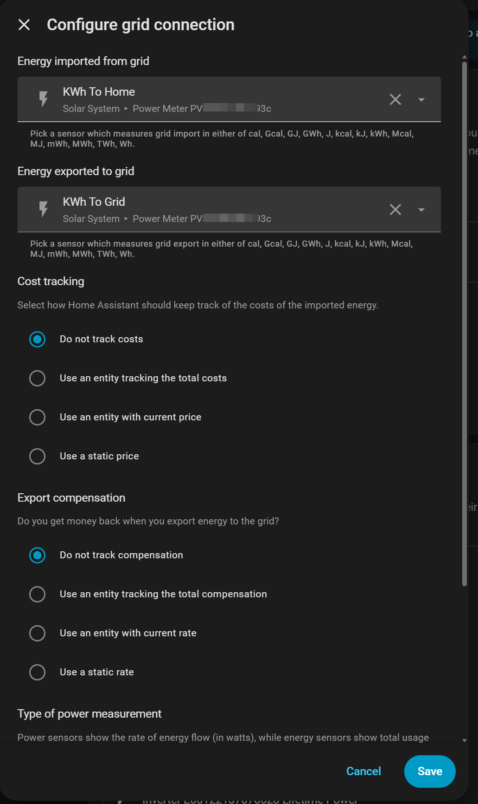
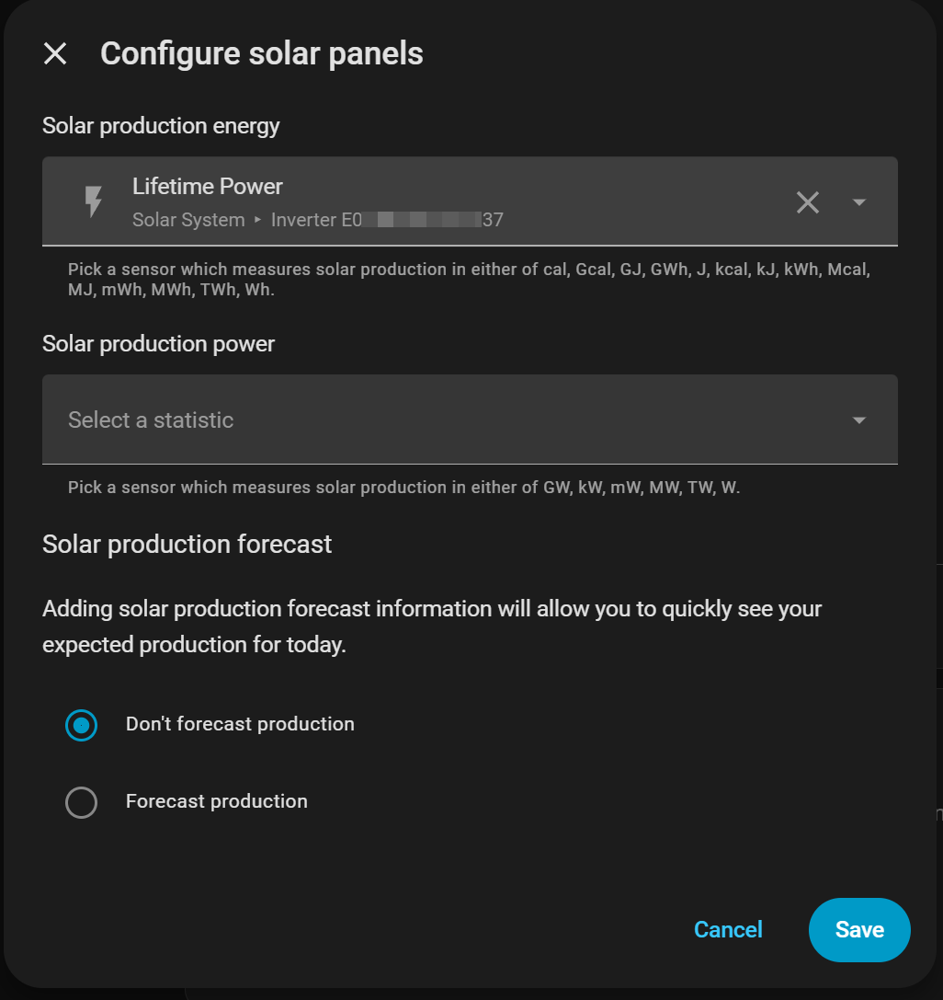

# Enhanced SunPower: Home Assistant Integration for SunPower PVS6 / PVS5 Solar Monitoring

Monitor your SunPower solar system locally from Home Assistant with no cloud dependency. Supports PVS5 and PVS6 hardware on new firmware, SunVault battery monitoring and control, individual inverter health tracking, and optional WebSocket live data.

> **New to Home Assistant?** See the [Getting Started Guide](docs/HA_SetupDoc.md) for help choosing hardware, installing Home Assistant, setting up HACS, and getting your PVS on WiFi before coming back here.

[](https://github.com/hacs/integration)
[](https://github.com/smcneece/ha-esunpower/releases)
[](https://github.com/smcneece/ha-esunpower/commits/main)
[](LICENSE)
[](https://github.com/smcneece)
[](https://github.com/smcneece/ha-esunpower/actions/workflows/hassfest.yaml)
[](https://github.com/smcneece/ha-esunpower/actions/workflows/hacs.yaml)

> [](https://github.com/sponsors/smcneece) SunStrong charges $100/year for their mobile monitoring app. This integration is free, runs locally, polls more frequently, keeps your full history under your control, and adds alerts for individual panels going offline. If it saves you money, consider sponsoring. Check out my [other HA Automations & Blueprints](https://github.com/smcneece?tab=repositories) too.

> ⭐ **Help Others Find This Integration!** If Enhanced SunPower is working well for you, please star this repository.
>
> [](https://github.com/smcneece/ha-esunpower/stargazers) [](https://github.com/smcneece/ha-esunpower/network/members)



---

## Requirements

**Firmware:** New firmware (varserver) required.
- **PVS6:** BUILD 61840 or higher
- **PVS5:** BUILD 5408 or higher

Check your firmware: Settings, Devices and Services, Enhanced SunPower, open the PV Supervisor device.

> ⚠️ **Old firmware users:** v2026.05.1 is the last release supporting old firmware. See [Old Firmware Install Guide](docs/old_firmware_install.md) to pin before updating.

**Network:** The integration connects directly to your PVS over your local network.
- **WiFi WAN (Recommended):** Connect PVS to your home WiFi, find the IP in your router's DHCP leases, reserve it
- **LAN port (Alternative):** Fixed IP `172.27.153.1`, requires VLAN isolation (LAN port runs its own DHCP server)
- **Ethernet WAN:** Not recommended - known intermittent reliability issues on PVS6

---

## Installation

**Can install any time of day** - dynamic entity discovery works even at night when inverters are offline.

[](https://my.home-assistant.io/redirect/hacs_repository/?owner=smcneece&repository=ha-esunpower&category=integration)

1. Click the button above, then **Open Link** in the browser prompt, then **Add** in the HACS window
2. Click **Download** (bottom right), then **Download** again on the version prompt
3. Restart Home Assistant (Settings shows a "Restart Required" repair at the top)
4. Add the integration:

[](https://my.home-assistant.io/redirect/config_flow_start/?domain=sunpower)

**During setup:** Enter your PVS IP address. Firmware version, serial number, and password are auto-detected. The 3-step wizard takes about 2 minutes. Default polling is 300 seconds; battery systems require 20s minimum.

---

## Energy Dashboard Setup

You can configure the Energy Dashboard right after install. Statistics take a few hours to accumulate and populate the charts, but the sensor setup itself can be done immediately.

**Step 1: Open Energy configuration**

In the HA sidebar click **Energy**, then the **pencil icon** (top right).

**Step 2: Add grid connection**

Click **Add grid connection** and set:
- **Energy imported from grid:** select `KWh To Home` (listed under Solar System, Power Meter ...c)
- **Energy exported to grid:** select `KWh To Grid` (same device)

> Use the **`...c` meter** (consumption meter). The `...p` meter does not have bidirectional grid sensors. If these sensors are missing, see [TROUBLESHOOTING.md](docs/TROUBLESHOOTING.md#energy-dashboard---missing-grid-importexport-sensors).



**Step 3: Add solar production**

Click **Add solar production**. In the Configure solar panels dialog:
- **Solar production energy:** search for `Lifetime Power` and select each inverter. Add each one separately for per-panel visibility in the Energy Dashboard.
- **Solar production power:** leave blank.



> **Tip:** [Solar Sentinel](https://github.com/smcneece/solar-sentinel) auto-discovers your inverters from the Energy Dashboard and gives you a live color-coded per-panel grid with a sun arc, time slider, and production charts.

**Step 4: Battery system (SunVault / ESS equipped systems only)**

Click **Add battery system** and set:
- **Energy charged into battery:** `SunVault ESS [N] Lifetime Energy Charged`
- **Energy discharged from battery:** `SunVault ESS [N] Lifetime Energy Discharged`
- **Power sensor type:** Two sensors, using `SunVault Power Input` and `SunVault Power Output`

> Battery Energy Dashboard setup is not fully verified since I don't have a battery system to test against. If you have a SunVault and find the correct mapping, please share it in [Discussions](https://github.com/smcneece/ha-esunpower/discussions) so others can benefit.

---

## Battery Control

Control your SunVault battery directly from Home Assistant. Requires new firmware and a battery system.

**Select entities** (on the PVS device):
- `Battery Control Mode` - Self Supply / Cost Savings / Reserve
- `Battery Reserve Percentage` - 5% to 100% in 5% increments

**Example TOU automation:**
```yaml
automation:
  - alias: "Battery: Cost Savings During Peak"
    trigger:
      - platform: time
        at: "15:00:00"
    action:
      - service: select.select_option
        target:
          entity_id: select.battery_control_mode
        data:
          option: "Cost Savings"
```

More examples: [docs/battery_tou_automation_example.yaml](docs/battery_tou_automation_example.yaml)

---

## WebSocket Live Data (PVS6 only)

After initial setup, PVS6 users can enable real-time 1-second WebSocket sensor updates via integration options (Settings, Devices & Services, Enhanced SunPower, Configure).

> ⚠️ **SD Card Warning:** Real-time updates generate significantly more database writes. If Home Assistant runs on an SD card, leave live data disabled or the card will wear out quickly. SSD storage is strongly recommended.

Live data sensors (production power, site load, net power, battery power, SOC, backup time) update as values change rather than on the poll schedule. See [TROUBLESHOOTING.md](docs/TROUBLESHOOTING.md#websocket-live-data-and-sd-cards) for recorder exclusion config.

**PVS5:** WebSocket live data is not supported on PVS5 hardware. The option will not appear for PVS5 installs.

---

## Available Data

**PVS System:** Load, uptime, memory, firmware, flash storage, error counts, diagnostic health sensors

**Inverters:** Power output, MPPT data, temperature, lifetime energy (per panel)

**Power Meters:** Production and consumption, voltage, frequency, lifetime kWh

**SunVault Battery:** State of charge, state of health, power, voltage, temperature, charge/discharge limits, operating mode

**WebSocket Live (PVS6):** Production power, site load, net power, battery power, SOC, backup time - all at 1-second resolution

**Diagnostic Dashboard:** Poll success rate, response time, consecutive failures, active inverter count

---

## Configuration Options

| Setting | Default | Notes |
|---------|---------|-------|
| Polling Interval | 300s | 10s min (20s for battery systems). 300s recommended for most users; faster polling does not give fresher inverter data |
| PVS Password | Auto-detected | Last 5 characters of PVS serial, pre-filled automatically |
| Flash Memory Threshold | 0 (off) | Alert level in MB; 30-50 MB recommended for early warning |
| Flash Wear Threshold | 90% | Alert at this wear percentage; 0 to disable |
| Mobile Device | Disabled | Select your phone for critical alerts |
| Email Notification | Disabled | Select HA email service for critical alerts |
| Enable WebSocket Live Data | Off | PVS6 only; requires SSD storage |
| Power Change Threshold | 0.05 kW | Min change to trigger live data state write |

---

## Troubleshooting

**Quick fixes:**
- **PVS not responding:** Verify IP address; WiFi WAN recommended for new firmware
- **All entities unavailable:** Hard refresh browser (Ctrl+F5)
- **Diagnostic sensors showing zeros:** Wait a few polling cycles
- **Mobile notifications not working:** Verify HA mobile app is installed and the service is configured

**Detailed guide:** [TROUBLESHOOTING.md](docs/TROUBLESHOOTING.md)

---

## What Makes This Different

Enhanced fork of [@krbaker's original SunPower integration](https://github.com/krbaker/hass-sunpower). Key improvements:

- **New firmware support:** Direct varserver API with authentication (krbaker's version does not support new firmware)
- **WebSocket live data:** 1-second real-time updates (PVS6 only)
- **Battery control:** Read and write battery mode and reserve percentage
- **Individual inverter health monitoring:** Per-panel failure detection and recovery alerts
- **Hold-last-value:** Sensors hold last known value through PVS outages and WebSocket reconnects
- **Outlier protection:** Prevents PVS data glitches from corrupting Energy Dashboard statistics
- **Flash memory monitoring:** Critical alerts before PVS storage fills up
- **Diagnostic dashboard:** 7 sensors tracking integration reliability

---

## Companion Apps

- [Solar Sentinel](https://github.com/smcneece/solar-sentinel) - Visual per-panel solar monitoring. Auto-discovers inverters from the Energy Dashboard and displays a live color-coded panel grid, sun arc, time slider, and production charts.
- [Battery Sentinel](https://github.com/smcneece/battery-sentinel) - Battery device, Z-Wave node, and Zigbee device monitoring and alerts.

---

## Support

- **Issues:** [GitHub Issues](https://github.com/smcneece/ha-esunpower/issues)
- **Discussions:** [GitHub Discussions](https://github.com/smcneece/ha-esunpower/discussions)
- **Changelog:** [CHANGELOG.md](docs/CHANGELOG.md)
- **Troubleshooting:** [TROUBLESHOOTING.md](docs/TROUBLESHOOTING.md)

---

## Credits & Attribution

- **Original Integration:** [@krbaker](https://github.com/krbaker) - Thank you for creating the foundation
- **ESS/Battery Support:** [@CanisUrsa](https://github.com/CanisUrsa) - Battery system integration
- **Enhanced Edition:** [@smcneece](https://github.com/smcneece) - Community-driven improvements

## Contributors

- **[@jtooley307](https://github.com/jtooley307)** - Dynamic entity discovery (PR #18), session management and re-authentication (PR #23)
- **[@joshchiou](https://github.com/joshchiou)** - Fixed memory leak from IP-serial virtual meter naming (PR #64)
- **Max Roberts** - Helping get basic battery functionality working
- **Ian Jones** - Beta testing battery control features

## License

Apache License 2.0. See [LICENSE](LICENSE). This integration is not affiliated with or endorsed by SunPower or SunStrong Corporation.

---

## Keywords

**Hardware:** SunPower PVS, PVS5, PVS6, SunStrong, SunVault, ESS Battery, Solar Inverters
**Software:** Home Assistant, HACS, Python
**Features:** Solar Monitoring, Inverter Health, Battery Tracking, Flash Wear, Energy Dashboard, WebSocket Live Data, Mobile Notifications

<!-- 
SEO Keywords: sunpower, sunstrong, pvs, pvs6, pvs5, home assistant, hacs, solar monitoring, 
solar panels, inverter monitoring, sunvault, battery storage, ess, energy storage system, 
pv monitoring, renewable energy, home automation, solar integration, solar power,
photovoltaic, firmware 61846, new firmware, authentication, krbaker, krbaker fork,
enhanced sunpower, sunpower integration, solar system monitoring, panel monitoring, inverter health,
battery health, state of charge, state of health, flash memory, flash wear, diagnostic sensors,
virtual production meter, mobile alerts, email notifications, energy dashboard integration
-->
