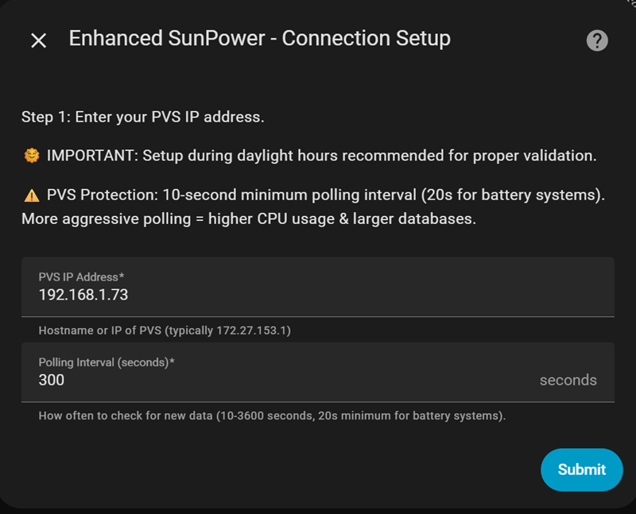

# Enhanced SunPower - The most feature-rich and best supported Home Assistant integration for your SunPower/SunStrong PVS

## PLEASE TAKE A FEW MINUTES TO READ

## **FIRMWARE COMPATIBILITY** 

**October 3, 2025 the integration should work with ALL PVS firmware versions** - Automatically detects and adapts to your firmware:
- **Firmware BUILD 61840+**: Uses official SunStrong `pypvs` library with LocalAPI authentication
- **Firmware BUILD < 61840**: Uses legacy dl_cgi endpoints
- **Auto-Detection**: Queries PVS for firmware BUILD number and selects correct method automatically
- **Safety Fallback**: If new firmware LocalAPI fails, automatically falls back to legacy mode

### Untested for battery systems - if you have a battery system please help us test support!

Open issues here: [GitHub Issues](https://github.com/smcneece/ha-esunpower/issues)

---

**⚠️ CRITICAL: If upgrading from original krbaker integration, BACK YOUR SYSTEM UP! (You are doing daily backups right?) BACKUP FIRST AND FOLLOW UPGRADE INSTRUCTIONS EXACTLY below!**

[](https://github.com/hacs/integration)
[](https://github.com/smcneece/ha-esunpower/releases)
[](https://github.com/smcneece/ha-esunpower/commits/main)
[](LICENSE)
[](https://github.com/smcneece)
[](https://github.com/smcneece/ha-esunpower/actions/workflows/hassfest.yaml)
[](https://github.com/smcneece/ha-esunpower/actions/workflows/hacs.yaml)

> [](https://github.com/sponsors/smcneece) <-- Why not sponsor me, even a few bucks shows you appreciate the work and gives encouragement. You can sponsor me monthly, or just a one time thing. Check out my [other HA Automations & Blueprints](https://github.com/smcneece?tab=repositories) while you're here. 

> **Enhanced Fork**: This is an improved version of [@krbaker's original SunPower integration](https://github.com/krbaker/hass-sunpower) with simplified 24/7 polling, comprehensive PVS protection, individual inverter health monitoring, and authentication support.

> ⭐ **Help Others Find This Integration!** If Enhanced SunPower is working well for you, please star this repository to help other SunPower owners discover these improvements!
> 
> [](https://github.com/smcneece/ha-esunpower/stargazers) [](https://github.com/smcneece/ha-esunpower/network/members)


## What Makes This Enhanced?

**Core Improvements:**
- **Flash Memory Monitoring**: Critical alerts for PVS storage & wear usage configurable notification thresholds
- **Simplified Polling**: Single consistent polling interval for reliable 24/7 monitoring
- **Individual Inverter Health Monitoring**: Failure detection and recovery alerts for each panel
- **Flexible Alert System**: Critical notifications sent directly to your phone as notifications, emails, and HA UI.
- **Diagnostic Dashboard**: 7 sensors tracking integration reliability and performance
- **PVS Hardware Protection**: Firmware-aware throttling (10s new firmware, 60s old firmware, 20s battery), health checking, and intelligent backoff

**Technical Enhancements:**
- **Multi-Channel Notifications**: 6 separate notification streams
- **Comprehensive Battery Monitoring**: 10 dedicated ESS/battery sensors (SOC, SOH, power, temps, voltages, charge/discharge limits) - more data than original or SunStrong forks
- **Modular Architecture**: Clean, well-commented, maintainable codebase with separated concerns
- **Production Reliability**: Battle-tested stability with comprehensive error handling and graceful degradation

## Important Notes & Breaking Changes

**Breaking Changes:**
- **Binary Sensors**: Now use proper boolean states (`on`/`off`) instead of text values like `"working"`. May break existing automations.
- **Minimum Polling**: Firmware-aware enforcement (10s new firmware, 60s old firmware, 20s battery systems). Default remains 300s for safety.

**Understanding Polling Intervals:**
- **Integration polls PVS** at your configured interval (10-3600 seconds)
- **PVS updates different data at different rates internally:**
  - **PVS gateway sensors** (uptime, RAM, CPU, errors) → Update every PVS scan (~30-60s)
  - **Meter/Inverter power sensors** → Update every ~5 minutes (PVS internal cache)
  - **Battery sensors** → Update more frequently (if battery system present)
- **Faster polling does NOT make meter/inverter data update faster** - this is controlled by PVS hardware, likely to reduce device polling stress
- **Verify polling works**: Watch PVS **Uptime** sensor - should update at your configured interval

**Migration Guide:**
```yaml
# OLD automation (will break):
- condition: state
  entity_id: binary_sensor.sunpower_pvs_state  
  state: "working"

# NEW automation (Enhanced SunPower):
- condition: state
  entity_id: binary_sensor.sunpower_pvs_state
  state: "on"
```

**Disclaimers:**
- Extensively tested on a 30-panel SunPower system **without batteries**. Battery system users welcome to test and provide feedback.

## Installation

### Requirements

**Install during daylight hours!**
- Inverters are powered by the sun and offline at night
- Integration validates real PVS connection during setup process

### Upgrading from SunStrong (pvs-hass) Integration

**Migration Tool Available:** See `tools/README_MIGRATION.md` for automated migration instructions.

The repository includes a standalone migration script that converts your SunStrong entities to Enhanced SunPower while preserving all historical data. The tool is currently in testing - check the documentation before using.

---

### Upgrading from Original Keith Baker (krbaker) SunPower Integration

**⚠️ This upgrade is a one-way process** - backup recommended before proceeding. You may be able to roll back, but my test failed, and I won't be investing time in debugging why.

**Step-by-Step Upgrade: GO SLOW**

1. **Remove Original Integration**
   - Go to "Settings" → "Devices & Services"
   - Find and click on "SunPower" integration → three dots menu → "Delete"

2. **Remove Original HACS Repository** (if installed via HACS)
   - Go to HACS → Integrations → Find "SunPower" → three dots → "Remove"
   - Also remove custom repo: HACS → 3 dots (top right) → "Custom repositories" → delete original repository

3. **Restart Home Assistant** (DO NOT SKIP)
   - Go to "Settings" → "System" → "Restart"

4. **Install Enhanced Version** (follow steps below)

5. **Clean Up Old Virtual Devices** (Battery Systems Only)
   - krbaker integration created "Virtual Battery" and "Virtual SunVault" devices
   - These will appear as orphaned/unavailable after upgrade
   - **Safe to delete manually** - Enhanced SunPower uses real ESS devices from PVS instead of virtual aggregations
   - Go to "Settings" → "Devices & Services" → "Entities" → Search for "virtual" → Delete orphaned entities

**Why Remove First?**
- Prevents entity conflicts between old and new versions
- Enhanced version automatically migrates configuration
- Entity history is preserved - no data loss

**Battery System Changes:**
- **Old krbaker approach**: Created virtual aggregation devices from ESS endpoint
- **Enhanced SunPower approach**: Uses real ESS devices from PVS with comprehensive sensor suite
- **Result**: More accurate data, better device organization, eliminates virtual device complexity
- **Note**: Some calculated sensors (power input/output based on amperage) may be unavailable due to pypvs library limitations

### Install via HACS

**Don't have HACS yet?** [Install HACS first](https://www.hacs.xyz/docs/use/) - it's the easiest way to manage custom integrations.

1. **Add Custom Repository:**

[](https://my.home-assistant.io/redirect/hacs_repository/?owner=smcneece&repository=ha-esunpower&category=integration)

2. This will open a webpage asking you to open a page in Home Assistant, click the Open Link Button.

3. A window should open asking to Add custom repository, click ADD on that window.

4. After a moment it should show you the integration page, with a Download button in the bottom right of screen, click that button to download, and click Download again when the new window opens asking about version.

5. Click the main "Settings" link in Home Assistant Sidebar, there should be a repair listed at the top saying Restart Required, click that and click Submit and then the Finish button. If it's not there, restart anyway!

6. Now to add the integration click link below, or on your main integration page in Home Assistant click Add Integration and look for the Enhanced Sunpower integration, and add it.

[](https://my.home-assistant.io/redirect/config_flow_start/?domain=sunpower)

### Automatic Discovery (Zeroconf)

**New!** Enhanced SunPower now supports automatic discovery for PVS5 and PVS6 systems:
- Home Assistant will automatically detect your PVS on the network
- You'll see a notification: "New device discovered - Enhanced SunPower"
- Click "Configure" to start setup with pre-filled IP address
- Works for both new and old firmware
- Manual setup still available if discovery doesn't work

### Network Best Practices

**Recommended:** Set a static DHCP reservation for your PVS IP address in your router settings.

- Prevents the PVS from receiving a new IP address after a DHCP lease renewal
- Ensures the integration continues polling without interruption
- Standard best practice for all IoT devices on your network
- Router configuration is beyond the scope of this guide, but most routers allow reserving IPs by MAC address

## Configuration

### Basic Setup (Page 1)


### Authentication (Page 2)


### Notifications & Advanced (Page 3)


### Setup Process
1. **Page 1**: Enter PVS IP (WAN or LAN) address and polling interval
   - Integration automatically detects firmware BUILD and serial number
   - Validates connection and selects optimal communication method
2. **Page 2**: Confirm password (auto-detected and pre-filled for new firmware)
   - Old firmware (BUILD < 61840): Password step skipped automatically
   - New firmware (BUILD ≥61840): Password pre-filled, just confirm
3. **Page 3**: Configure notifications and advanced settings
   - Set flash memory threshold
   - Select mobile device for critical alerts
   - Configure email notifications

### Configuration Options

| Setting | Description | Default | Recommended |
|---------|-------------|---------|-------------|
| **Host** | PVS IP Address | N/A | WAN: `192.168.1.x` <br>LAN: `172.27.153.1` |
| **Polling Interval** | Update frequency (seconds) | 300 | 10-3600 seconds (firmware-aware: 10s new, 60s old, 20s battery) |
| **PVS Password (last 5)** | Auto-detected from serial number | Auto-filled | Confirm auto-detected value (new firmware only) |
| **Flash Memory Threshold** | PVS storage alert level (MB) | 0 (disabled) | 30-50 MB for early warning |
| **Flash Wear Threshold** | PVS flash lifetime alert (%) | 90 (90% wear) | 0 to disable, 85-95% recommended |
| **Email Notification Service** | Email service for critical alerts | Disabled | Select email service to enable |
| **Email Recipient** | Override recipient address | `` | Enter send to Email address |
| **General Notifications** | Show status updates | `true` | Enable for monitoring |
| **Debug Notifications** | Show diagnostic info | `false` | Enable for troubleshooting |
| **Replace Status Notifications** | Reuse notifications | `false` | Enable to reduce clutter |
| **Mobile Device** | Device for critical alerts | Disabled | Select your phone |

### 🔒 PVS Authentication (Automatic!)

**✨ Fully Automated** - No manual serial number entry required!

**How Auto-Detection Works:**
1. Integration queries PVS for firmware BUILD number and full serial number
2. Automatically extracts last 5 characters for authentication password
3. Pre-fills password field in UPPERCASE format (matches serial format)
4. For old firmware (BUILD < 61840): Skips password step entirely
5. For new firmware (BUILD ≥61840): Shows pre-filled password for confirmation

**Firmware-Specific Behavior:**
- **BUILD < 61840**: No authentication required, password step skipped automatically
- **BUILD ≥61840**: LocalAPI authentication with auto-detected password
- **Buggy Firmware**: Automatic fallback to legacy mode if LocalAPI fails
- **Failed Detection**: Manual password entry available as fallback

**Manual Override (if needed):**
If auto-detection fails, you can manually enter the last 5 characters of your PVS serial:
- **Physical Device**: Remove PVS cover - serial on device label
- **SunPower/SunStrong App**: Profile → System Info → Serial Number
- **Format**: UPPERCASE letters/numbers only (e.g., "W3193" not "w3193")

**Authentication Details:**
- **Username**: `ssm_owner` (configured by SunStrong Management)
- **Password**: Last 5 characters of your PVS serial number
- **Coverage**: Applied to both main device polling and battery system endpoints
- **Error Handling**: Clear messages when authentication fails or serial number needed

### Polling Configuration

**Simplified Architecture**: Single consistent polling interval for reliable 24/7 monitoring:

**Use Cases:**
- **Continuous monitoring**: Track both solar production and consumption throughout the day
- **PVS hardware protection**: 300-second minimum protects against overloading
- **Battery support**: Automatic detection and monitoring of SunVault systems
- **Home automation**: Reliable data for automations and energy tracking

**Configuration:**
- **Standard setup**: 300 seconds (5 minutes) - recommended default balancing data freshness with hardware protection
- **Faster updates (new firmware)**: 10-60 seconds for frequent data updates
- **Conservative setup**: 600-3600 seconds for minimal PVS load
- **Battery systems**: 20-second minimum (per SunStrong guidance for less aggressive polling)
- **Old firmware**: 60-second minimum enforced automatically for hardware protection

**SunStrong Recommendations:**
- **Battery systems**: Use less aggressive polling intervals to reduce system load
- **Non-battery systems**: 10-second minimum supported for future varserver compatibility
- **Current default**: 300 seconds maintained for proven stability

**Benefits:**
- Consistent behavior - no complex day/night mode switching
- Simpler troubleshooting - predictable polling schedule
- Better battery support - continuous monitoring with appropriate intervals
- Hardware protection - built-in minimums prevent system overload
- Future-ready - prepared for varserver's faster capabilities

**Performance Considerations:**
- **Faster polling (10-60s)**: Significantly increases Home Assistant database size - 10s polling creates 30x more data than 300s polling
- **Database growth**: With ~50 solar entities, 10s polling generates ~180,000 database entries per hour vs 600 entries with 300s polling
- **Hardware impact**: Larger databases slow performance on Raspberry Pi systems, affect backup times, and increase storage requirements
- **Standard polling (300s)**: Recommended default balances data freshness with manageable database size
- **Conservative polling (600-3600s)**: Minimal database growth, ideal for basic monitoring and slower hardware

## Available Data

### PVS System Monitoring
- System load, uptime, memory usage, firmware version
- Communication errors and scan statistics  
- Flash storage availability with critical alerts
- Diagnostics and health monitoring

### Solar Production
- **Inverters**: Power output, individual MPPT data, temperature monitoring
- **Power Meters**: Energy consumption/production, voltage, frequency
- **Virtual Meter**: Aggregated inverter data when no physical meter present

### SunVault Battery System (if equipped)
- **Individual Batteries**: State of charge, voltage, current, temperature
- **ESS System**: Environmental conditions, power meters
- **Hub Plus**: Grid status, phase voltages, humidity monitoring

### Individual Inverter Health Monitoring
- **24-Hour Persistent Error Tracking**: Only alerts after 24+ hours of continuous problems, eliminating false positives
- **Batched Notifications**: Multiple inverter issues grouped into single notification instead of spam
- **Smart Recovery Detection**: Automatic notifications when persistent issues resolve after extended periods
- **Context-Aware Monitoring**: Understands normal inverter dormancy (nighttime STATE="error") vs actual hardware failures
- **Gmail Rate Limit Protection**: Prevents overwhelming email services with notification floods

### Diagnostic Dashboard
- **Poll Success Rate**: Real-time percentage of successful PVS polls
- **Total Polls**: Integration activity counter since startup
- **Consecutive Poll Failures**: Current streak of failed PVS poll attempts for troubleshooting
- **Last Successful Poll**: Timestamp of last successful data retrieval (e.g., "14:29 08-16-25")
- **Average Response Time**: PVS performance monitoring
- **Active Inverters**: Count of responding inverters
- **PVS Uptime**: System availability tracking


### Smart Notification System

Multi-channel notification system:


**Notification Channels:**
- Setup, Polling, Health, Inverter status
- Mobile notifications with smart fallback to persistent notifications
- Email notifications for critical alerts (PVS offline, inverter failures, flash memory critical)

#### Email Notification Setup

**Prerequisites:**
1. **Email Integration**: Set up a Home Assistant email integration (Gmail, SMTP, etc.)
2. **Service Detection**: The integration auto-detects available email services

**Configuration:**
1. **Navigate**: Configuration → Page 3 (Notifications)
2. **Select Service**: Choose your email service from dropdown (e.g., "Gmail" or "SMTP")
3. **Custom Recipient** (Optional): Override default with dedicated notification address
4. **Submit**: Email notifications are automatically enabled

**Critical Alerts That Trigger Emails:**
- ⚠️ **Flash Memory Critical**: PVS storage below threshold
- 🔴 **PVS Offline**: System connectivity failures
- ⚠️ **Inverter Failures**: Individual inverter offline detection
- 🔑 **Authentication Errors**: PVS6 firmware authentication issues
- 🔧 **Hardware Issues**: Critical system protection alerts

**Example Gmail Setup:**
```yaml
# configuration.yaml
notify:
  - name: gmail_smtp
    platform: smtp
    server: smtp.gmail.com
    port: 587
    sender: your-email@gmail.com
    username: your-email@gmail.com
    password: your-app-password
    recipient: homeassistant-alerts@gmail.com
```

**Best Practices:**
- **Dedicated Account**: Use separate email for HA notifications
- **App Passwords**: Use Gmail app passwords (not account password)
- **Test**: Use Flash Memory Threshold = 199 MB to trigger test email
- **Recipient Override**: Enter custom email for dedicated notification accounts

### Energy Dashboard Integration

**Enhanced SunPower Integration** provides comprehensive data for Home Assistant's Energy Dashboard. After installation and configuration, you can then configure your Energy Dashboard. Allow the integration to run for a few hours to generate statistics.

**Entity Naming:** The integration shows proper inverter identification (e.g., "Inverter E001221370442207 Lifetime Power") for easy energy dashboard setup.

**Setting Up Solar Production:**
- **Production Meter**: `sensor.power_meter_*p_lifetime_power` (most accurate)
- **Virtual Production Meter**: `sensor.virtual_production_meter_*_lifetime_power` (aggregated)
- **Individual Panels**: Add each `sensor.sunpower_inverter_*_lifetime_power` separately


**Setting Up Grid Consumption:**

**⚠️ IMPORTANT: Use the 'c' meter sensors (CT clamps), NOT the 'p' meter or "Lifetime Power" sensors!**

- **Grid consumption**: `sensor.power_meter_*c_kwh_to_home`
- **Return to grid**: `sensor.power_meter_*c_kwh_to_grid`

**Why the 'c' meter?** Only the 'c' consumption meter (CT clamps) provides the bidirectional energy sensors needed for proper Energy Dashboard calculations. The 'p' production meter and "Lifetime Power" sensors only show net totals and will cause incorrect calculations.

**⚠️ TROUBLESHOOTING: Grid sensors not available?**
- **Missing consumption meter entirely**: CT clamps may not be installed OR not provisioned in PVS settings - contact installer
- **CT clamps present but not working**: Installer may need to provision/enable them in PVS configuration
- **PVS5 limitation**: Some PVS5 systems only report net consumption, not separate import/export - see [TROUBLESHOOTING.md](TROUBLESHOOTING.md#energy-dashboard---missing-grid-importexport-sensors) for detailed troubleshooting
- **Alternative**: Use utility smart meter integration for most accurate grid tracking


**Solar Panel Configuration:**
For individual panel monitoring, add each inverter's lifetime power sensor:


**Setting Up Home Battery Storage (Battery Systems Only):**

If you have a SunVault or ESS battery system, configure battery monitoring in the Energy Dashboard:

**Energy going in to the battery (charging):**
- `sensor.sunpower_ess_{serial}_pos_lte_kwh`
- Displayed as: "ESS {serial} Positive Lifetime Energy"

**Energy coming out of the battery (discharging):**
- `sensor.sunpower_ess_{serial}_neg_lte_kwh`
- Displayed as: "ESS {serial} Negative Lifetime Energy"

These sensors track the total energy flow through your battery system over its lifetime, providing accurate charging/discharging history for the Energy Dashboard.

### Monitoring Approach Recommendations

**For 24/7 Full-Time Monitoring:**

**Utility Smart Meter (Best Accuracy)**
- Direct utility company integration where available
- Real-time production/consumption data
- Grid-tied accuracy for billing reconciliation

**Dedicated CT Energy Monitor (Recommended)**
For comprehensive whole-home monitoring, I recommend dedicated current transformer (CT) systems:

**[SEM-Meter (Smart Home Energy Meter)](https://www.amazon.com/Energy-Monitor-Circuit-Sensors-Real-Time/dp/B0D6VZQBPF?th=1)** *(Developer Tested)*
- **Whole house**: ~$100 for main monitoring
- **Circuit-level**: ~$129 for 16 individual circuits & mains. 
- **100% Local Operation** - No cloud dependency required
- **Direct HA integration** via MQTT
- **Real-time updates** (1-second intervals)
- **Professional installation** recommended for CT clamps

*This monitor is used and recommended by the integration developer for production reliability.*

**Enhanced SunPower Role**
- **Individual inverter diagnostics** - Per-panel performance monitoring
- **PVS system health** - Firmware tracking, error detection, communication monitoring
- **Equipment maintenance** - Temperature monitoring, MPPT analysis, inverter health tracking
- **Solar-specific metrics** - Frequency analysis, power factor, voltage regulation
- **System reliability** - Integration performance and diagnostic monitoring
- **Network troubleshooting** - Connection monitoring and diagnostic capabilities
- **Simplified polling** - Consistent 24/7 monitoring

**Why Separate Monitoring Systems?**

**Energy Monitor Strengths:**
- Real-time data (1-second updates)
- Continuous reliability (purpose-built for 24/7 operation)  
- Energy Dashboard optimized (designed for utility-scale accuracy)
- Whole-home coverage (beyond just solar)

**Enhanced SunPower Strengths:**
- Equipment diagnostics (individual component health)
- PVS integration (official system monitoring)
- Environmental data (temperatures, frequencies)
- Maintenance alerts (firmware updates, communication errors)
- Inverter health tracking (individual panel monitoring)
- MPPT monitoring (DC-side performance analysis)
- Integration reliability (diagnostic dashboard monitoring)
- Network intelligence (connection monitoring and diagnostics)
- Simplified 24/7 polling

**Together:** Complete solar installation monitoring from grid-level accuracy down to individual panel performance, network connectivity, and panel-specific scheduling.

**Polling Frequency:** Enhanced SunPower supports 10-3600 second intervals with firmware-aware minimums (10s new firmware, 60s old firmware, 20s battery systems), with a conservative 300-second default. Fast polling capabilities prepare for upcoming varserver migration while maintaining hardware protection.

## Network Setup

### PVS Port Selection

**New Firmware (BUILD 61840+):**
- **WAN Port (Recommended)**: Use the PVS WAN port IP address (gets DHCP, typically `192.168.1.x`)
  - Easier to discover via your router's DHCP client list
  - No fixed IP to remember
  - Authentication eliminates need for network isolation
- **LAN Port (Alternative)**: Fixed IP `172.27.153.1` also works
  - Requires knowing the fixed address
  - Same authentication and features as WAN port

**Old Firmware (BUILD < 61840):**
- **LAN Port Required**: Must use `172.27.153.1`
- **Network Isolation Required**: PVS LAN port must be isolated (VLAN or separate network)
  - See [TROUBLESHOOTING.md](TROUBLESHOOTING.md) for VLAN setup
  - Or use Raspberry Pi proxy ([@krbaker's documentation](https://github.com/krbaker/hass-sunpower#network-setup))

**Quick Test:** Check if your WAN port responds: `curl http://YOUR_PVS_WAN_IP/cgi-bin/dl_cgi/supervisor/info`

## Troubleshooting

**Quick Fixes:**
- **PVS Not Responding**: Check network connectivity, verify IP address (WAN port recommended for new firmware)
- **All Entities Unavailable**: Force browser refresh (Ctrl+F5 / Cmd+Shift+R) to clear cached files
- **Diagnostic Sensors Not Working**: Wait for a few polling cycles, check "Enhanced SunPower Diagnostics" device
- **Mobile Notifications Not Working**: Verify Home Assistant mobile app installed and mobile service configured

**For detailed troubleshooting**: See [TROUBLESHOOTING.md](TROUBLESHOOTING.md)

## Contributing

We welcome contributions! Please:
1. Fork this repository
2. Create a feature branch
3. Test thoroughly with real PVS hardware
4. Submit a pull request with detailed description

**Development Guidelines:**
- Test both solar-only and battery-equipped systems
- Never increase polling frequency or add PVS stress
- Maintain backward compatibility with existing configurations

## License

This project is licensed under the Apache License 2.0 - see the [LICENSE](LICENSE) file for details.

## Credits & Attribution

- **Original Integration**: [@krbaker](https://github.com/krbaker) - Thank you for creating the foundation
- **ESS/Battery Support**: [@CanisUrsa](https://github.com/CanisUrsa) - Battery system integration
- **Enhanced Edition**: [@smcneece](https://github.com/smcneece) - Community-driven improvements for production reliability

## Disclaimer

This integration is not affiliated with or endorsed by SunPower or SunStrong Corporation. Use at your own risk. The PVS management interface was designed for installation/provisioning, not continuous monitoring. This enhanced version includes comprehensive protections, but prolonged use should be monitored for any effects on PVS performance or SunPower cloud connectivity.

## Support

- **Issues**: [GitHub Issues](https://github.com/smcneece/ha-esunpower/issues)
- **Discussions**: [GitHub Discussions](https://github.com/smcneece/ha-esunpower/discussions)  
- **Community**: [Home Assistant Community Forum](https://community.home-assistant.io/)
- **Changelog**: [CHANGELOG.md](CHANGELOG.md)
- **Troubleshooting**: [TROUBLESHOOTING.md](TROUBLESHOOTING.md)

---

**Enjoying reliable SunPower monitoring with simplified 24/7 polling, mobile alerts, individual inverter health tracking, authentication support, and diagnostic dashboard monitoring? Consider starring this repository to help others find these improvements!**

---

## Keywords

**Hardware:** SunPower PVS, SunPower PVS5, SunPower PVS6, SunStrong, SunVault, ESS Battery, Solar Inverters  
**Software:** Home Assistant, HACS, Python, pypvs, krbaker fork  
**Features:** Solar Monitoring, Inverter Health, Battery Tracking, Flash Wear, Energy Dashboard, Mobile Notifications

<!-- 
SEO Keywords: sunpower, sunstrong, pvs, pvs6, pvs5, home assistant, hacs, solar monitoring, 
solar panels, inverter monitoring, sunvault, battery storage, ess, energy storage system, 
pv monitoring, renewable energy, home automation, solar integration, pypvs, solar power, 
photovoltaic, firmware 61840, new firmware, old firmware, authentication, krbaker, krbaker fork,
enhanced sunpower, sunpower integration, solar system monitoring, panel monitoring, inverter health,
battery health, state of charge, state of health, flash memory, flash wear, diagnostic sensors,
night-time caching, virtual production meter, mobile alerts, email notifications, VLAN routing,
automatic route repair, health monitoring, performance tracking, energy dashboard integration
-->
