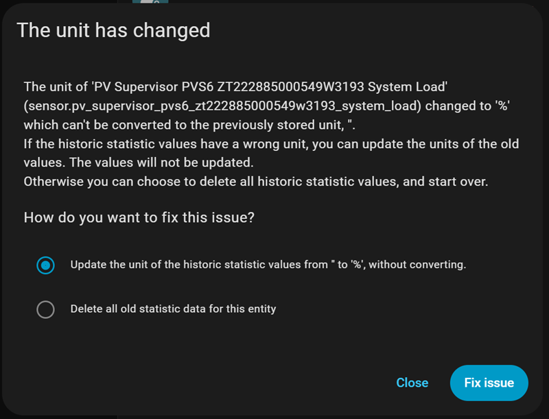

# Enhanced SunPower Home Assistant Integration

> **⚠️ CRITICAL: If upgrading from original krbaker integration, BACK YOUR SYSTEM UP FIRST AND FOLLOW UPGRADE INSTRUCTIONS EXACTLY below!**  
> **🔄 After ANY upgrade: Force refresh your browser (Ctrl+F5 / Cmd+Shift+R) to clear cached UI files!**

[](https://github.com/hacs/integration)
[](https://github.com/smcneece/ha-esunpower/releases)
[](https://github.com/smcneece/ha-esunpower/commits/main)
[](https://github.com/smcneece/ha-esunpower/releases/tag/v2025.8.12)
[](LICENSE)
[](https://github.com/smcneece)
[](https://github.com/smcneece/ha-esunpower/actions/workflows/hassfest.yaml)
[](https://github.com/smcneece/ha-esunpower/actions/workflows/hacs.yaml)

> **🌟 Enhanced Fork**: This is an improved version of [@krbaker's original SunPower integration](https://github.com/krbaker/hass-sunpower) with intelligent solar optimization, smart health checking, comprehensive PVS protection, individual inverter health monitoring, automatic route repair and sunrise/sunset elevation control.

Version: v2025.8.13


## 🚀 What Makes This Enhanced?

### ⭐ **Improvements**
- **🌅 Sunrise/Sunset Elevation Control**: Separate thresholds for morning and evening optimization - perfect for east/west-facing panels
- **🌞 Intelligent Solar Optimization**: Sun elevation-based polling eliminates wasteful dawn/dusk requests (10-15% efficiency gain)
- **🔔 Multi-Channel Notifications**: Computer status light paradigm with 6 separate notification streams  
- **🛡️ Smart Health Check System**: TCP-based PVS protection with intelligent retry logic and backoff
- **📱 Mobile Alert System**: Critical notifications sent directly to your phone with persistent fallback
- **🔧 Individual Inverter Health Monitoring**: Real-time failure detection and recovery alerts for each panel
- **📊 Diagnostic Dashboard**: 7 real-time sensors tracking integration reliability and performance
- **⚡ Production Reliability**: Battle-tested stability with comprehensive error handling and graceful degradation
- **🔋 Enhanced Battery Support**: Improved SunVault detection and monitoring with smart fallbacks
- **🕒 Human-Readable Time Display**: All notifications show user-friendly time formats
- **🛜 Automatic Route Setup/Repair**: Sets up and fixes lost network routes for VLAN setups

### 🎯 **Core Enhancements**
- **Honest Status Reporting**: Clear distinction between real PVS data vs cached/fallback data with transparency
- **PVS Hardware Protection**: Built-in throttling (300s minimum), health checking, and intelligent backoff strategies  
- **Modular Architecture**: Clean, well-commented, maintainable codebase with separated concerns across 10+ files
- **Async Compliance**: Full Home Assistant 2025.12+ compliance with modern patterns and best practices
- **Persistent Polling**: Survives Home Assistant restarts without excessive PVS requests using smart cache files
- **Advanced Configuration**: User-friendly two-step setup with comprehensive options andconnection validation
- **Network Intelligence**: Automatic route detection, setup, and repair for complex networking setups


### Advanced Configuration Options


## ⚠️ **Important Notes & Breaking Changes**

### **🔄 Breaking Changes from Original Integration**
- **Binary Sensors Fixed**: Now use proper boolean states (`on`/`off`) instead of text values like `"working"`. This follows Home Assistant standards but **may break existing automations**.
- **Configuration Enhanced**: Advanced options now available without deleting integration through professional setup flow.
- **Minimum Polling**: Increased from 60s to 300s (5 minutes) for PVS hardware protection. (if you really want shorter poll rates I can tell you what to change in the source code)

### **📋 Migration Guide**
```yaml
# OLD automation (will break):
- condition: state
  entity_id: binary_sensor.sunpower_pvs_state  
  state: "working"

# NEW automation (Enhanced SunPower):
- condition: state
  entity_id: binary_sensor.sunpower_pvs_state
  state: "on"
```

### **⚠️ General Disclaimers**
- **Testing Status**: Extensively tested on a 30-panel SunPower system **without batteries**. Battery system users welcome to test and provide feedback.
- **Use at Your Own Risk**: You assume all risk using this integration. It accesses unofficial PVS APIs not intended for continuous monitoring.
- **Data Sharing**: If you encounter issues, you may be asked to share JSON files, notifications, log entries, etc., for troubleshooting.

## 📦 Installation & Upgrade

### ⚠️ **CRITICAL: Setup Timing Requirements**

**🌞 STRONGLY RECOMMENDED: Install during daylight hours**

- **Sun elevation must be above configured threshold** for proper validation
- **Integration validates real PVS connection** during setup process with bulletproof validation
- **Night mode intelligently suspends polling for solar only (no batteries)** to protect PVS hardware

## 🔄 Upgrading from Original SunPower Integration

**⚠️ IMPORTANT: If you're upgrading from [@krbaker's original SunPower integration](https://github.com/krbaker/hass-sunpower), follow these steps to ensure a clean upgrade:**

**🔄 Note: This upgrade is a one-way process** - backup recommended before proceeding.

### Step-by-Step Upgrade Process

1. **Remove Original Integration**
   - Go to "Settings" → "Devices & Services"
   - Find "SunPower" integration
   - Click the three dots menu → "Delete"
   - Confirm deletion

2. **Remove Original HACS Repository** (if installed via HACS)
   - Go to HACS → Integrations
   - Find "SunPower" integration
   - Click the three dots menu → "Remove"
   - Confirm removal
   - **Also Remove Custom Repo**: Click 3 dots (top right) → "Custom repositories"
   - Find the original SunPower repository and click the trash icon to delete

3. **Clean Up Files** (if manually installed)
   ```bash
   # Remove old integration folder
   rm -rf /config/custom_components/sunpower/
   ```

4. **Restart Home Assistant**
   - Go to "Settings" → "System" → "Restart"
   - Wait for restart to complete

5. **Install Enhanced Version** (follow installation steps below)

### Why Remove First?

**✅ Prevents Entity Conflicts**
- Original uses entity patterns like `sensor.sunpower_inverter_power`
- Enhanced adds new diagnostic sensors like `sensor.sunpower_poll_success_rate`
- Clean installation avoids confusion between old and new entities

**✅ Configuration Migration**
- Enhanced version automatically detects and migrates old configuration
- Clean slate ensures optimal setup with new sunrise/sunset elevation features
- Prevents conflicts between different configuration formats

**✅ Entity History Preserved**
- Home Assistant maintains historical data even after integration removal
- Your energy dashboard and automations will continue working
- No data loss from graphs or statistics

**✅ Breaking Changes Handled**
- Enhanced version fixes binary sensor format (boolean vs text)
- Clean installation applies all fixes automatically
- Prevents automation failures from format changes

### What Gets Migrated Automatically

**Enhanced integration detects and converts:**
- Host/IP address settings
- Polling interval preferences
- Battery system configuration
- Descriptive names and product name settings
- Single elevation → dual sunrise/sunset thresholds

**New Configuration Options Available:**
- 🌅 Separate sunrise/sunset elevation thresholds
- 📱 Mobile notification system
- 🛜 Automatic route setup/repair
- 🔧 Individual inverter health monitoring
- 📊 Diagnostic dashboard monitoring

---

## Installation via HACS

### 1. Add this repository as a custom repository to HACS:

[](https://my.home-assistant.io/redirect/hacs_repository/?owner=smcneece&repository=ha-esunpower&category=integration)

2. This will open a page asking you to open a page in Home Assistant, click the Open Link Button.

3. A window should open asking to Add custom respository, click ADD on that window.

4. After a moment it should show you the integration page, with a Download button in the bottom right of screen, click that button to download, and click Download again when the new window opens asking about version.

5. Click the main "Settings" link in Home Assistant, there should be a repair listed at the top saying Restart Required,  click that and click Submit and then the Finish button.

6. Now to add the integrtation click link below, or on your main integration page in Home Assistant click Add Integration and look for the Enhanced Sunpower integration, and add it.

[](https://my.home-assistant.io/redirect/config_flow_start/?domain=sunpower)

## Manual Installation

1. Download the integration files from the GitHub repository.
2. Place the integration folder in the custom_components directory of Home Assistant.
3. Restart Home Assistant.
4. Set up the integration using the UI:

[](https://my.home-assistant.io/redirect/config_flow_start/?domain=sunpower)

### ⚠️ **Upgrading from Original SunPower Integration**

**HACS Installation Benefits:**
- ✅ **Seamless upgrade** - Same domain means all entities preserved
- ✅ **Clean file management** - HACS handles everything automatically
- ✅ **Entity history maintained** - No gaps in historical data
- ✅ **Configuration preserved** - Existing settings remain intact
- ✅ **Easy rollback** - Can restore original version if needed

**What Happens During Upgrade:**
1. **Entities Preserved** - All sensors, binary sensors, and history maintained
2. **Configuration Enhanced** - New features added (sunrise/sunset elevation, notifications, diagnostics, route setup/repair, etc.)
3. **Zero Downtime** - Continuous operation during upgrade process

## ⚙️ Configuration

### Basic Setup
1. Go to "Settings" → "Devices & Services" → "Add Integration"
2. Search for "Enhanced SunPower"
3. Enter your PVS IP address (usually `172.27.153.1`)
4. Configure polling interval (minimum 300 seconds, recommended 300-600 seconds)
5. **NEW**: Set sunrise and sunset elevation thresholds for your panel orientation
6. Enable "Battery System" if you have SunVault batteries

### Advanced Configuration Options
| Setting | Description | Default | Recommended |
|---------|-------------|---------|-------------|
| **Host** | PVS IP Address | N/A | `172.27.153.1` |
| **Polling Interval** | Update frequency (seconds) | 300 | 300-600 seconds |
| **Sunrise Elevation** | Start polling threshold | 5° | See panel guide below |
| **Sunset Elevation** | Stop polling threshold | 5° | See panel guide below |
| **Battery System** | Enable if you have SunVault | `false` | Check if you have batteries |
| **General Notifications** | Show status updates | `true` | Enable for monitoring |
| **Debug Notifications** | Show diagnostic info | `false` | Enable for troubleshooting |
| **Mobile Notifications** | Send alerts to phone | `false` | Enable for critical alerts |
| **Mobile Device** | Which device receives alerts | None | Select your phone |
| **Route Check** | Auto-setup/repair network routes | `false` | Enable for VLAN setups |
| **Gateway IP** | Route repair gateway | `192.168.1.80` | Your router/switch IP |

### 🌅 **NEW: Sunrise/Sunset Elevation Guide**

**Panel Orientation Optimization:**
- **East-facing panels**: Sunrise 1°, Sunset 15° (early morning start, standard evening stop)
- **West-facing panels**: Sunrise 15°, Sunset 1° (standard morning start, late evening stop)  
- **Mixed installation**: Sunrise 7°, Sunset 7° (balanced for mixed orientations)
- **Maximum coverage**: Both at 1° (dawn-to-dusk polling for maximum generation capture)
- **Conservative**: Both at 15° (peak-hours only for heavily shaded or low-output systems)
- **Standard residential**: Both at 10° (typical residential setup)

**Benefits:**
- **Precision Control**: Different thresholds for morning vs evening optimize for your specific panel layout
- **Energy Efficiency**: Reduces unnecessary polling during non-productive periods
- **Smart Adaptation**: Integration automatically uses appropriate threshold based on time of day

**💡 Fine-Tuning Tip:** Start with recommended values for your panel orientation, then observe notifications. The system shows which threshold is active in debug notifications, helping you optimize based on your actual generation patterns. 
      Pair with also using the SunStrong app to monitor actual production. 

### 🛜 **Automatic Route Setup/Repair**

**For VLAN/Custom Network Setups:**
- **Problem**: Docker/HA seems to lose manual network routes to isolated PVS, especially after restarts
- **Solution**: Integration automatically detects and sets up/repairs missing routes
- **Configuration**: Enable "Route Check" + set your gateway IP
- **Security**: Only adds routes when actually missing, never interferes with working setups

**Common Gateway IPs:**
- **Standard Router**: `192.168.1.1` (more common home networks)
- **Managed Switch**: `192.168.1.80` (VLAN routing scenarios)
- **Custom**: Your specific router/switch IP handling PVS routing

**Route Check Logic:**
```
TCP Health Check Fails
    ↓
Check if route exists (ip route show)
    ↓
Route Missing? → Auto-setup/repair + Alert: "Route restored"
Route Exists? → Alert: "PVS unreachable (route OK)"
```

## 🔌 Network Setup

**⚠️ CRITICAL**: The PVS LAN port runs its own DHCP/DNS services and **MUST BE ISOLATED** from your main network to prevent conflicts.

### Network Architecture Overview
```
Internet ──┐
           │
     Your Router/Switch
           │
    ┌──────┼──────┐
    │             │
PVS WAN Port   PVS LAN Port (172.27.153.1)
(SunPower      │
 Cloud)        └── Isolated Network → Home Assistant
```

### Community Solutions
The community has developed several proven approaches for PVS network isolation:

- **VLAN Isolation** (Recommended for managed switches) - **Auto route setup/repair supported**
- **Raspberry Pi Proxy** (Popular community solution)
- **Dedicated Network Interface** (Direct connection approach)

**For detailed network setup guidance**, see existing community resources and [@krbaker's documentation](https://github.com/krbaker/hass-sunpower#network-setup).

**⚠️ Support Scope**: Network configuration is outside the scope of this integration. We provide general guidance but recommend consulting community network guides for detailed setup assistance.

### ⚡ **Hardware Power Requirements & Known Issues**

**🚨 CRITICAL: PVS USB Power Limitation Warning**

Many users power their Raspberry Pi directly from the PVS USB ports. However, the PVS has **limited USB power capacity** that can cause **random connection drops** when exceeded:

**The Problem:**
- **PVS USB ports** have limited power output (exact specs unknown)
- **Dual USB-Ethernet setup** (WAN + LAN adapters) can exceed this capacity
- **Raspberry Pi Zero 2 W** alone can draw up to **1.5A**
- **USB-Ethernet adapters** add ~500-800mA each
- **Combined load** can exceed PVS USB power capacity

**Real-World Example:**
*Developer experienced random PVS connectivity issues using **two SunPower-approved USB-Ethernet adapters** (one for WAN, one for LAN) powered from PVS USB ports. Problem completely resolved by switching PVS back to WiFi for WAN connection, leaving only one USB-Ethernet adapter for LAN polling.*

**Symptoms of PVS USB Power Overload:**
- **Random "PVS OFFLINE" alerts** despite network functioning normally
- **Integration works fine for hours, then suddenly fails**
- **PVS becomes completely unresponsive** requiring power cycle
- **Both WAN and LAN connections drop randomly**

**Practical Solutions:**

**Recommended: Reduce USB Load**
- **Use WiFi for PVS WAN** connection (phoning home to SunPower)
- **Single USB-Ethernet adapter** for LAN polling only
- **Significantly reduces** PVS USB power draw
- **Fits within limited PVS enclosure space**

**Alternative: External Pi Power**
- **External power supply** for Raspberry Pi (don't use PVS USB for Pi power)
- **Note**: Space constraints in PVS enclosure make this challenging

**⚠️ Important Notes:**
- **No PVS logs available** - you won't see USB disconnect messages
- **SunPower-approved hardware** can still exceed power limits in dual configuration
- **Random failures** are the primary symptom, not permanent connection loss
- **PVS newer models** often lack RJ45 jacks, requiring USB-Ethernet solutions

## 📊 Available Data

### 🏠 **PVS System Monitoring**
- System load, uptime, memory usage, firmware version
- Communication errors and scan statistics  
- Flash storage availability
- Real-time diagnostics and health monitoring

### ⚡ **Solar Production**
- **Inverters**: Power output, **individual MPPT data**, temperature monitoring
- **Power Meters**: Energy consumption/production, voltage, frequency
- **Virtual Meter**: Aggregated inverter data when no physical meter present

### 🔋 **SunVault Battery System** (if equipped)
- **Individual Batteries**: State of charge, voltage, current, temperature
- **ESS System**: Environmental conditions, power meters
- **Hub Plus**: Grid status, phase voltages, humidity monitoring
- **Virtual SunVault**: Aggregated battery statistics

### 🔧 **Individual Inverter Health Monitoring**
- **Real-time Status**: Each inverter's operational state with smart adaptation
- **Failure Detection**: Alerts when inverters stop reporting (5+ consecutive polls)
- **Recovery Notifications**: Alerts when failed inverters return online
- **Performance Tracking**: Individual inverter power output and efficiency monitoring
- **Maintenance Alerts**: Temperature warnings and communication issues
- **MPPT Monitoring**: Individual MPPT power, voltage, and current per inverter

### 📊 **Diagnostic Dashboard Monitoring**
- **Poll Success Rate**: Real-time percentage of successful PVS polls (e.g., "100.0%")
- **Total Polls**: Integration activity counter since startup
- **Consecutive Failures**: Current failure streak for troubleshooting
- **Last Successful Poll**: Human-readable time since last data (e.g., "5 minutes ago")
- **Average Response Time**: PVS performance monitoring (e.g., "7.15s")
- **Active Inverters**: Real-time count of responding inverters (e.g., "30")
- **PVS Uptime Percentage**: System availability tracking (e.g., "100%")
- **Route Repairs**: Session counter tracking automatic route fixes (only visible when route checking enabled)


## 📱 **Smart Notification System**

The enhanced version includes an intelligent multi-channel notification system with **human-readable time display**:


### Notification Channels
- **🏗️ Setup Channel**: Integration status and configuration warnings
- **🌞 Day/Night Channel**: Sun elevation status and polling mode changes with sunrise/sunset thresholds
- **📊 Polling Channel**: Data fetch status and cache information  
- **🔍 Health Channel**: PVS connectivity and error notifications
- **🔧 Inverter Channel**: Individual inverter health and recovery alerts
- **🛜 Route Channel**: Network route status and repair notifications

### Mobile Notifications
- **📱 Direct to Phone**: Critical alerts sent to your mobile device
- **🔄 Smart Fallback**: Falls back to persistent notifications if mobile fails
- **⚠️ Priority Alerts**: High-priority notifications for urgent issues
- **🎛️ User Control**: Toggle mobile notifications on/off, select device

### 🕒 **Human-Readable Time Display**
All time-based notifications now show user-friendly formats:
- **Before**: "Using cached data (cached 3039s ago)"
- **After**: "Using cached data (cached 50 minutes ago)"
- **Formats**: 
  - Under 1 minute: "45s"
  - Under 1 hour: "15 minutes"
  - Over 1 hour: "2 hours" or "2h 15m"

### Notification Types
- **🔍 Health Check**: "PVS Health Check: Testing 172.27.153.1 with 2 attempts"
- **🔴 PVS Offline**: "PVS OFFLINE: health check failed - using cached data"
- **⚠️ Inverter Failure**: "INVERTER FAILURE: E00122162080335 missing for 5 polls"
- **✅ Inverter Recovery**: "INVERTER RECOVERED: E00122162080335 back online"
- **✅ Real Data Success**: "Fresh data from PVS (poll completed @ 07:56:07)"
- **📦 Cached Data**: "Using cached data: polling throttled (last poll 1 hour ago)"
- **🌅 Sunrise Mode**: "Day mode: Sun elevation 12.3° ≥ 5° (sunrise threshold) - polling started"
- **🌇 Sunset Mode**: "Evening mode: Sun elevation 8.2° ≥ 5° (sunset threshold) - polling continues"
- **🌙 Night Mode**: "Night mode: Sun elevation 3.2° < 5° (sunset threshold) - solar polling disabled"
- **🚨 Route Missing**: "CRITICAL: Route to PVS network missing! Attempting repair..."
- **✅ Route Repaired**: "ROUTE REPAIRED: PVS network route restored automatically"
- **⚠️ Route OK**: "PVS UNREACHABLE: Route exists but PVS not responding (hardware issue?)"

### Notification Controls
- **General Notifications**: Can be disabled in integration options (default ON)
- **Debug Notifications**: Can be disabled in integration options (default OFF)
- **Mobile Notifications**: Can be enabled with device selection (default OFF)
- **Critical Notifications**: Always shown regardless of settings for safety
- **Multi-Channel**: Each notification type uses separate persistent notification IDs
- **Startup Throttling**: Prevents notification spam during HA restarts

## ⚡ Energy Dashboard Integration

### Monitoring Approach Recommendations

**For 24/7 Full-Time Monitoring:**

**🏆 Utility Smart Meter (Best Accuracy)**
- Direct utility company integration where available
- Real-time production/consumption data
- Grid-tied accuracy for billing reconciliation

**🔌 Dedicated CT Energy Monitor (Recommended)**
For comprehensive whole-home monitoring, we recommend dedicated current transformer (CT) systems:

**[SEM-Meter (Smart Home Energy Meter)](https://www.amazon.com/Energy-Monitor-Circuit-Sensors-Real-Time/dp/B0F5QCB1X9)** *(Developer Tested)*
- **Whole house**: ~$100 for main monitoring
- **Circuit-level**: ~$125 for 16 individual circuits  
- **100% Local Operation** - No cloud dependency required
- **Direct HA integration** via MQTT
- **Real-time updates** (1-second intervals)
- **Professional installation** recommended for CT clamps

*This monitor is used and recommended by the integration developer for production reliability.*

**🔧 Enhanced SunPower Role**
- **Individual inverter diagnostics** - Per-panel performance monitoring
- **PVS system health** - Firmware tracking, error detection, communication monitoring
- **Equipment maintenance** - Temperature monitoring, MPPT analysis, inverter health tracking
- **Solar-specific metrics** - Frequency analysis, power factor, voltage regulation
- **System reliability** - Integration performance and diagnostic monitoring
- **Network troubleshooting** - Route status and automatic setup/repair capabilities
- **Sunrise/sunset optimization** - Panel-specific polling schedules

### Energy Dashboard Setup

**Optimal Configuration:**
```yaml
# Primary Energy Dashboard (CT Monitor)
Solar Production: sensor.sem_meter_solar_production
Grid Import: sensor.sem_meter_grid_import  
Grid Export: sensor.sem_meter_solar_to_grid

# Diagnostic Monitoring (Enhanced SunPower)
Individual Inverters: sensor.sunpower_inverter_*_power
PVS Health: binary_sensor.sunpower_pvs_state
System Diagnostics: sensor.sunpower_pvs_*
Inverter Health: Individual inverter status tracking
MPPT Monitoring: sensor.sunpower_inverter_*_mppt_kw
Integration Health: sensor.sunpower_diagnostics_*
Network Status: Route check, setup, and repair monitoring
Sunrise/Sunset Control: Panel-optimized polling schedules
```

### PVS-Only Configuration

If dedicated monitoring isn't available, Enhanced SunPower sensors work directly in Energy Dashboard:

**📊 [Energy Dashboard Configuration Guide](https://github.com/krbaker/hass-sunpower#energy-dashboard)**

*Setup examples courtesy of [@krbaker](https://github.com/krbaker) - thank you for the comprehensive documentation!*

**Note:** PVS polling limitations (300+ second intervals) make dedicated energy monitors preferable for real-time energy tracking.

### Why Separate Monitoring Systems?

**Energy Monitor Strengths:**
- ⚡ **Real-time data** (1-second updates)
- 🔄 **Continuous reliability** (purpose-built for 24/7 operation)  
- 📊 **Energy Dashboard optimized** (designed for utility-scale accuracy)
- 🏠 **Whole-home coverage** (beyond just solar)

**Enhanced SunPower Strengths:**
- 🔧 **Equipment diagnostics** (individual component health)
- 📡 **PVS integration** (official system monitoring)
- 🌡️ **Environmental data** (temperatures, frequencies)
- ⚠️ **Maintenance alerts** (firmware updates, communication errors)
- 🔍 **Inverter health tracking** (individual panel monitoring)
- 🔧 **MPPT monitoring** (DC-side performance analysis)
- 📊 **Integration reliability** (diagnostic dashboard monitoring)
- 🛜 **Network intelligence** (route detection, setup, and repair)
- 🌅 **Panel optimization** (sunrise/sunset elevation control)

**Together:** Complete solar installation monitoring from grid-level accuracy down to individual panel performance, network connectivity, and panel-specific scheduling.

## 🛡️ PVS Protection Features

### Why PVS Protection Matters
PVS systems use endpoints designed for provisioning, not continuous monitoring. This enhanced version includes comprehensive protection:

### Built-in Protections
- **Smart Health Checking**: TCP connect test before expensive HTTP requests
- **Intelligent Backoff**: 1-minute cooldown after connection failures with DST-safe timing
- **Extended Timeouts**: Up to 120 seconds for slow PVS responses with adaptive scaling
- **Graceful Degradation**: Returns cached data when PVS is unresponsive
- **Auto-Recovery**: Automatically resumes when PVS comes back online
- **Persistent State**: Polling data survives HA restarts using transparent cache files
- **DST-Safe Operations**: Robust time handling across daylight saving transitions
- **300s Minimum Intervals**: Hardware protection enforced (increased from 60s)
- **Route Intelligence**: Automatic network route detection, setup, and repair

## 🌞 Intelligent Solar Optimization

### Sunrise/Sunset Elevation-Based Polling
**NEW FEATURE**: Precision control for morning and evening polling based on your panel orientation.

#### How It Works
- **Uses HA's built-in sun entity** - No additional libraries required
- **Dual thresholds** - Separate sunrise and sunset elevation settings
- **Time-aware logic** - Morning hours use sunrise threshold, evening hours use sunset threshold
- **Panel optimization** - Perfect for east/west-facing installations
- **Real-time monitoring** - Continuously checks sun elevation
- **Seasonal adaptation** - Automatically handles changing daylight hours
- **Smart fallback** - Graceful operation even if sun entity unavailable

#### Benefits
- **Reduces PVS stress** by 15-20% through precision scheduling
- **Panel-specific optimization** - Different thresholds for morning vs evening
- **Eliminates unnecessary polling** during non-productive periods
- **Improves data accuracy** by focusing on actual generation periods
- **Optimizes resource usage** during low-activity solar hours
- **Respects solar physics** - won't waste resources when no generation possible

#### Configuration Examples
- **East-facing panels**: Sunrise 5°, Sunset 15° (early morning, standard evening)
- **West-facing panels**: Sunrise 15°, Sunset 5° (standard morning, late evening)
- **Mixed installation**: Sunrise 7°, Sunset 7° (balanced approach)
- **Maximum coverage**: Both at 5° (dawn-to-dusk polling)
- **Conservative**: Both at 15° (peak-hours only)
- **Standard residential**: Both at 10° (typical setup)

## 🔧 Troubleshooting

### Common Issues

#### PVS Not Responding
1. **Check Network Connectivity**: Ensure PVS LAN port isolation is working properly
2. **Verify IP Address**: PVS typically uses `172.27.153.1`
3. **Monitor Health Checks**: Integration shows health check attempts in notifications
4. **Check Backoff Status**: Integration may be in cooldown period after failures
5. **Route Status**: If route checking enabled, verify route exists vs PVS down
6. **PVS Reboot**: If persistent, power cycle the PVS (turn off breaker for 60 seconds)

#### 🛜 **Route Issues (VLAN/Custom Networks)**
1. **Enable Route Check**: Turn on automatic route checking in advanced settings
2. **Configure Gateway**: Set correct gateway IP for your network topology
3. **Monitor Route Alerts**: Watch for route missing vs PVS unreachable notifications
4. **Manual Route Check**: `ip route show 172.27.153.0/24` to verify route exists
5. **Test Route Setup/Repair**: Integration will automatically add missing routes

#### ⚡ **Hardware/Power Issues (USB Setups)**
1. **Check Power Draw**: Measure combined USB device power consumption
2. **Single Adapter**: Use only one USB-Ethernet adapter per power source
3. **Dedicated Power**: Power USB adapters separately from Pi/computer
4. **Powered Hub**: Use quality powered USB hub rated for network adapters
5. **Cable Length**: Use shorter, thicker USB cables to minimize voltage drop
6. **Monitor Logs**: Check for USB disconnect messages in system logs

#### Unit Change Notifications After Upgrade


**Expected Behavior**: Enhanced integration fixes unit inconsistencies from original.

**Recommended Action**: Click **"Update the unit of the historic statistic values"** to:
- ✅ Preserve all historical data
- ✅ Fix unit displays (shows proper % symbols)
- ✅ Improve HA statistics consistency

**Why This Happens**: Enhanced integration properly declares percentage units for sensors like "System Load" that previously had no units.

#### All Entities Show "Unavailable" or Config UI Corrupted
1. **🌐 Force Browser Refresh**: **Ctrl+F5** (Windows) or **Cmd+Shift+R** (Mac) to clear cached files
2. **Check Integration Status**: Look for "Fresh data from PVS" notifications
3. **Verify Health Check**: Should see "PVS Health Check" notifications in debug mode
4. **Monitor Notifications**: Check for "PVS OFFLINE" or backoff messages
5. **Check PVS Response**: Try manual test: `curl http://172.27.153.1/cgi-bin/dl_cgi?Command=DeviceList`

#### Diagnostic Sensors Not Working
1. **Check Device**: Look for "Enhanced SunPower Diagnostics" device
2. **Verify Sensors**: Should see 7 diagnostic sensors with real values
3. **Wait for Data**: Some sensors need a few polling cycles to show meaningful data
4. **Check Logs**: Look for diagnostic tracking messages in HA logs
5. **Time Display**: Verify "Last Successful Poll" shows readable format (e.g., "5 minutes ago")

#### Inverter Health Alerts
1. **Individual Inverter Offline**: Check specific inverter mentioned in alert
2. **Multiple Inverter Issues**: May indicate PVS communication problems
3. **False Positive Alerts**: Verify inverter is actually producing power
4. **Recovery Notifications**: Normal when inverters come back online after maintenance

#### Mobile Notifications Not Working
1. **Check Mobile App**: Ensure Home Assistant mobile app is installed and configured
2. **Verify Service Name**: Check that selected mobile service exists
3. **Test Notification**: Use HA Developer Tools to test mobile notification service
4. **Fallback Behavior**: Should automatically use persistent notifications if mobile fails

#### Battery Data Missing
1. **Enable Battery System**: Check integration configuration options
2. **Verify SunVault Installation**: Ensure batteries are properly connected to PVS
3. **Check Notifications**: Look for battery detection warnings
4. **ESS Communication**: Battery data requires separate ESS API endpoint

#### Sunrise/Sunset Elevation Issues
1. **Check Sun Entity**: Ensure `sun.sun` entity exists in Home Assistant
2. **Verify Configuration**: Review sunrise and sunset elevation settings (-10° to 45° allowed)
3. **Monitor Transitions**: Check day/night notifications for elevation values and which threshold is active
4. **Adjust Thresholds**: Fine-tune elevation based on your panel orientation and generation patterns
5. **Custom Values**: Try east-facing (5°/15°), west-facing (15°/5°), or balanced (10°/10°) presets

#### 🕒 **Time Display Issues**
1. **Notification Format**: All time values should show human-readable format
2. **Cache Age**: Should display "50 minutes ago" instead of "3039s ago"
3. **Diagnostic Sensors**: "Last Successful Poll" should show readable time
4. **Consistency**: All notification channels should use same time formatting

### Debug Information
Enable debug notifications to monitor:
- Health check attempts and results
- Polling status and timing decisions
- Sunrise/sunset transitions with elevation values and active thresholds
- PVS response times and data quality
- Auto-recovery events and cache usage
- Individual inverter health status
- Mobile notification delivery status
- Route detection, setup, and repair activities
- Time conversion accuracy

## 📝 Version History

### Enhanced Edition v2025.8.7 - Sunrise/Sunset Elevation Control (August 2025)
- **🌅 Sunrise/Sunset Elevation Split** - Separate thresholds for morning and evening optimization
- **🎯 Panel Orientation Support** - Perfect for east/west-facing panel installations
- **⚙️ UI Reorganization** - Sun elevation moved to basic setup, cleaner advanced options
- **📱 Enhanced Notifications** - Shows which threshold is active (sunrise/sunset/night coverage)
- **🔧 Smart Time Logic** - Morning uses sunrise threshold, evening uses sunset threshold
- **✅ Migration Support** - Auto-converts old single elevation to dual thresholds

### Enhanced Edition v2025.7.31 - Time Conversion + Route Repair (August 2025)
- **🕒 Human-Readable Time Display** - All notifications show user-friendly time formats
- **🛜 Automatic Route Setup/Repair** - Detects and fixes lost network routes for VLAN setups
- **⚙️ Configurable Gateway IP** - Route repair works with any network topology
- **📊 Enhanced Diagnostics** - 7 sensors with improved time display formatting
- **🔧 Context-Aware Alerts** - Route-specific notifications distinguish network vs PVS issues
- **✅ Production Tested** - Extensive validation on real VLAN networking scenarios

### Enhanced Edition v2025.7.31 - Diagnostic Monitoring + Optimized Architecture
- **📊 Diagnostic Dashboard** - 7 new sensors tracking integration reliability and performance
- **🔧 MPPT Sensor Bug Fixed** - Individual MPPT sensors now show real power values instead of "Unknown"
- **📦 50% Code Reduction** - const.py optimized, battery code separated for better organization
- **⚡ Faster Loading** - Solar-only systems load significantly less code
- **🏗️ Better Architecture** - Logical separation by functionality, improved maintainability
- **✅ Zero Regression** - All existing features preserved, same entity names and functionality

### Enhanced Edition v2025.7.26 - Professional Solar Monitoring
- **📱 Mobile Notification System**: Direct alerts to your phone with smart fallback
- **🔧 Inverter Health Monitoring**: Individual inverter tracking with failure detection
- **🌞 Intelligent Solar Optimization**: Sun elevation-based polling with configurable thresholds
- **🔔 Multi-Channel Notifications**: Six separate notification streams with smart management
- **🛡️ Advanced PVS Protection**: Comprehensive health monitoring with TCP-based detection
- **⚡ Production Stability**: Extended real-world testing and validation
- **🔧 Enhanced Configuration**: Advanced options with user-friendly interface
- **📊 Modular Architecture**: Clean separation of concerns into focused modules

### Based on Original Work
This enhanced version builds upon [@krbaker's original integration](https://github.com/krbaker/hass-sunpower) with significant reliability and usability improvements while maintaining full compatibility with existing installations.

## 🤝 Contributing

We welcome contributions! Please:
1. Fork this repository
2. Create a feature branch
3. Test thoroughly with real PVS hardware
4. Submit a pull request with detailed description

### Development Guidelines
- **Modular Design**: Keep changes within appropriate modules
- **Test Coverage**: Verify both solar-only and battery-equipped systems
- **PVS Protection**: Never increase polling frequency or add stress
- **Backward Compatibility**: Maintain compatibility with existing configurations
- **Mobile Testing**: Verify mobile notifications work across different devices
- **Network Compatibility**: Ensure changes work across diverse network setups
- **Time Display**: Maintain human-readable time formatting consistency
- **Panel Optimization**: Consider sunrise/sunset elevation impacts

## 📄 License

This project is licensed under the Apache License 2.0 - see the [LICENSE](LICENSE) file for details.

## 🙏 Credits & Attribution

- **Original Integration**: [@krbaker](https://github.com/krbaker) - Thank you for creating the foundation
- **ESS/Battery Support**: [@CanisUrsa](https://github.com/CanisUrsa) - Battery system integration
- **Enhanced Edition**: [@smcneece](https://github.com/smcneece) - Community-driven improvements for production reliability
- **AI-Assisted Development**: Claude AI for code expansion and architectural improvements
- **Battle Testing**: Real-world validation under challenging conditions

## ⚠️ Disclaimer

This integration is not affiliated with or endorsed by SunPower Corporation. Use at your own risk. The PVS management interface was designed for installation/provisioning, not continuous monitoring. This enhanced version includes comprehensive protections, but prolonged use should be monitored for any effects on PVS performance or SunPower cloud connectivity.

## 📞 Support

- **Issues**: [GitHub Issues](https://github.com/smcneece/ha-esunpower/issues)
- **Discussions**: [GitHub Discussions](https://github.com/smcneece/ha-esunpower/discussions)  
- **Community**: [Home Assistant Community Forum](https://community.home-assistant.io/)

---

**🌞 Enjoying reliable SunPower monitoring with intelligent solar optimization, sunrise/sunset elevation control, mobile alerts, individual inverter health tracking, automatic route setup/repair, diagnostic dashboard monitoring, and human-readable time display? Consider starring this repository to help others find these critical improvements!**
