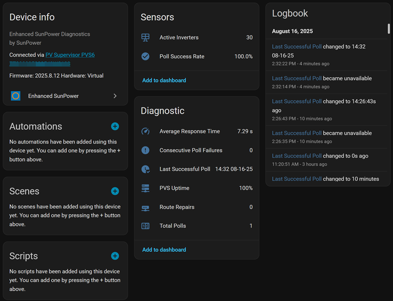
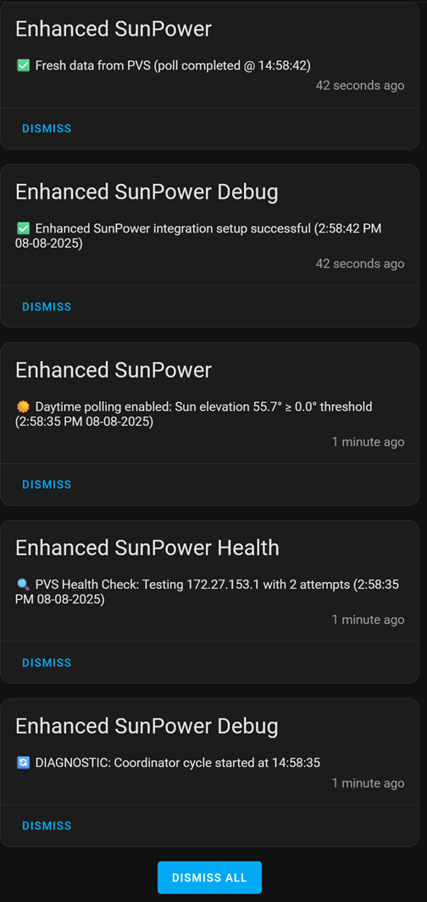

# Enhanced SunPower Home Assistant Integration

> **⚠️ CRITICAL: If upgrading from original krbaker integration, BACK YOUR SYSTEM UP FIRST AND FOLLOW UPGRADE INSTRUCTIONS EXACTLY below!**  
> **🔄 After ANY upgrade: Force refresh your browser (Ctrl+F5 / Cmd+Shift+R) to clear cached UI files!**

[](https://github.com/hacs/integration)
[](https://github.com/smcneece/ha-esunpower/releases)
[](https://github.com/smcneece/ha-esunpower/commits/main)
[](LICENSE)
[](https://github.com/smcneece)
[](https://github.com/smcneece/ha-esunpower/actions/workflows/hassfest.yaml)
[](https://github.com/smcneece/ha-esunpower/actions/workflows/hacs.yaml)

> [](https://github.com/sponsors/smcneece) <-- Why not sponsor me, even a few bucks shows you appreciate the work and gives encouragement. You can sponser me monthly, or just a one time thing. Check out my [other HA Automations & Blueprints](https://github.com/smcneece?tab=repositories) while you're here. 

> **Enhanced Fork**: This is an improved version of [@krbaker's original SunPower integration](https://github.com/krbaker/hass-sunpower) with intelligent solar optimization, comprehensive PVS protection, individual inverter health monitoring, automatic route repair and sunrise/sunset elevation control.

> ⭐ **Help Others Find This Integration!** If Enhanced SunPower is working well for you, please star this repository to help other SunPower owners discover these improvements!
> 
> [](https://github.com/smcneece/ha-esunpower/stargazers) [](https://github.com/smcneece/ha-esunpower/network/members)


## What Makes This Enhanced?

**Core Improvements:**
- **Flash Memory Monitoring**: Critical alerts when PVS storage drops below configurable threshold
- **Sunrise/Sunset Elevation Control**: Separate thresholds for morning and evening optimization - perfect for east/west-facing panels
- **Individual Inverter Health Monitoring**: Failure detection and recovery alerts for each panel
- **Mobile Alert System**: Critical notifications sent directly to your phone with smart fallback
- **Diagnostic Dashboard**: 8 real-time sensors tracking integration reliability and performance
- **Automatic Route Setup/Repair**: Sets up and fixes lost network routes for VLAN setups
- **Human-Readable Time Display**: All notifications show user-friendly time formats
- **PVS Hardware Protection**: Built-in throttling (300s minimum), health checking, and intelligent backoff

**Technical Enhancements:**
- **Multi-Channel Notifications**: 6 separate notification streams with computer status light paradigm
- **Enhanced Battery Support**: Improved SunVault detection and monitoring with smart fallbacks
- **Modular Architecture**: Clean, well-commented, maintainable codebase with separated concerns
- **Production Reliability**: Battle-tested stability with comprehensive error handling and graceful degradation

## Important Notes & Breaking Changes

**Breaking Changes:**
- **Binary Sensors**: Now use proper boolean states (`on`/`off`) instead of text values like `"working"`. May break existing automations.
- **Minimum Polling**: Increased from 60s to 300s (5 minutes) for PVS hardware protection.

**Migration Guide:**
```yaml
# OLD automation (will break):
- condition: state
  entity_id: binary_sensor.sunpower_pvs_state  
  state: "working"

# NEW automation (Enhanced SunPower):
- condition: state
  entity_id: binary_sensor.sunpower_pvs_state
  state: "on"
```

**Disclaimers:**
- Extensively tested on a 30-panel SunPower system **without batteries**. Battery system users welcome to test and provide feedback.
- You assume all risk using this integration. It accesses unofficial PVS APIs not intended for continuous monitoring.

## Installation

### Requirements

**STRONGLY RECOMMENDED: Install during daylight hours**
- Sun elevation must be above configured threshold for proper validation
- Integration validates real PVS connection during setup process

### Upgrading from Original SunPower Integration

**⚠️ This upgrade is a one-way process** - backup recommended before proceeding.

**Step-by-Step Upgrade:**

1. **Remove Original Integration**
   - Go to "Settings" → "Devices & Services"
   - Find and click on "SunPower" integration → three dots menu → "Delete"

2. **Remove Original HACS Repository** (if installed via HACS)
   - Go to HACS → Integrations → Find "SunPower" → three dots → "Remove"
   - Also remove custom repo: HACS → 3 dots (top right) → "Custom repositories" → delete original repository

3. **Restart Home Assistant** (DO NOT SKIP)
   - Go to "Settings" → "System" → "Restart"

4. **Install Enhanced Version** (follow steps below)

**Why Remove First?**
- Prevents entity conflicts between old and new versions
- Enhanced version automatically migrates configuration
- Entity history is preserved - no data loss

### Install via HACS

**Don't have HACS yet?** [Install HACS first](https://www.hacs.xyz/docs/use/) - it's the easiest way to manage custom integrations.

1. **Add Custom Repository:**

[](https://my.home-assistant.io/redirect/hacs_repository/?owner=smcneece&repository=ha-esunpower&category=integration)

2. This will open a webpage asking you to open a page in Home Assistant, click the Open Link Button.

3. A window should open asking to Add custom repository, click ADD on that window.

4. After a moment it should show you the integration page, with a Download button in the bottom right of screen, click that button to download, and click Download again when the new window opens asking about version.

5. Click the main "Settings" link in Home Assistant Sidebar, there should be a repair listed at the top saying Restart Required, click that and click Submit and then the Finish button. If it's not there, restart anyway!

6. Now to add the integration click link below, or on your main integration page in Home Assistant click Add Integration and look for the Enhanced Sunpower integration, and add it.

[](https://my.home-assistant.io/redirect/config_flow_start/?domain=sunpower)

## Configuration

### Basic Setup (Page 1)


### Solar Configuration (Page 2)


### Notifications & Advanced (Page 3)


### Setup Process
1. **Page 1**: Enter PVS IP address, polling interval, battery system, route gateway IP
2. **Page 2**: Configure sunrise/sunset elevation thresholds and naming preferences  
3. **Page 3**: Set flash memory threshold, notification preferences, and mobile device

### Configuration Options

| Setting | Description | Default | Recommended |
|---------|-------------|---------|-------------|
| **Host** | PVS IP Address | N/A | `172.27.153.1` |
| **Polling Interval** | Update frequency (seconds) | 300 | 300-600 seconds |
| **Battery System** | Enable if you have SunVault | `false` | Check if you have batteries |
| **Gateway IP** | Route repair (leave empty to disable) | `` | Your router IP for VLAN setups |
| **Sunrise Elevation** | Start polling threshold | 5° | See guide below |
| **Sunset Elevation** | Stop polling threshold | 5° | See guide below |
| **Use Descriptive Names** | Show detailed inverter names | `true` | Enable for energy dashboard |
| **Use Product Names** | Add 'SunPower' prefix | `false` | Personal preference |
| **Flash Memory Threshold** | PVS storage alert level (MB) | 0 (disabled) | 30-50 MB for early warning |
| **General Notifications** | Show status updates | `true` | Enable for monitoring |
| **Debug Notifications** | Show diagnostic info | `false` | Enable for troubleshooting |
| **Replace Status Notifications** | Reuse notifications | `false` | Enable to reduce clutter |
| **Mobile Device** | Device for critical alerts | Disabled | Select your phone |

### Sunrise/Sunset Elevation Guide

**Panel Orientation Optimization:**
- **East-facing panels**: Sunrise 1°, Sunset 15° (early morning start, standard evening stop)
- **West-facing panels**: Sunrise 15°, Sunset 1° (standard morning start, late evening stop)  
- **Mixed installation**: Sunrise 7°, Sunset 7° (balanced for mixed orientations)
- **Maximum coverage**: Both at 1° (dawn-to-dusk polling for maximum generation capture)
- **Standard residential**: Both at 10° (typical residential setup)

**Benefits:**
- Precision control optimizes for your specific panel layout
- Reduces unnecessary polling during non-productive periods
- Integration automatically uses appropriate threshold based on time of day

## Available Data

### PVS System Monitoring
- System load, uptime, memory usage, firmware version
- Communication errors and scan statistics  
- Flash storage availability with critical alerts
- Real-time diagnostics and health monitoring

### Solar Production
- **Inverters**: Power output, individual MPPT data, temperature monitoring
- **Power Meters**: Energy consumption/production, voltage, frequency
- **Virtual Meter**: Aggregated inverter data when no physical meter present

### SunVault Battery System (if equipped)
- **Individual Batteries**: State of charge, voltage, current, temperature
- **ESS System**: Environmental conditions, power meters
- **Hub Plus**: Grid status, phase voltages, humidity monitoring

### Individual Inverter Health Monitoring
- Real-time status for each inverter with smart adaptation
- Failure detection when inverters stop reporting (5+ consecutive polls)
- Recovery notifications when failed inverters return online
- Performance tracking and temperature warnings

### Diagnostic Dashboard
- **Poll Success Rate**: Real-time percentage of successful PVS polls
- **Total Polls**: Integration activity counter since startup
- **Consecutive Poll Failures**: Current streak of failed PVS poll attempts for troubleshooting
- **Last Successful Poll**: Timestamp of last successful data retrieval (e.g., "14:29 08-16-25")
- **Average Response Time**: PVS performance monitoring
- **Active Inverters**: Real-time count of responding inverters
- **PVS Uptime**: System availability tracking
- **Route Repairs**: Counter tracking automatic route fixes (when enabled)



### Smart Notification System

Multi-channel notification system with human-readable time display:



**Notification Channels:**
- Setup, Day/Night, Polling, Health, Inverter, Route status
- Mobile notifications with smart fallback to persistent notifications
- Human-readable time formats ("50 minutes ago" vs "3039s ago")

### Energy Dashboard Integration

**Enhanced SunPower Integration** provides comprehensive data for Home Assistant's Energy Dashboard. After installation and configuration, you can then configure your Energy Dashboard. Allow the integration to run for a few hours to generate statistics. 

**Entity Naming:** The integration shows proper inverter identification (e.g., "Inverter E001221370442207 Lifetime Power") for easy energy dashboard setup.

**Setting Up Solar Production:**
- **Production Meter**: `sensor.power_meter_*p_lifetime_power` (most accurate)
- **Virtual Production Meter**: `sensor.virtual_production_meter_*_lifetime_power` (aggregated)
- **Individual Panels**: Add each `sensor.sunpower_inverter_*_lifetime_power` separately


**Setting Up Grid Consumption:**
- **Consumption from Grid**: `sensor.power_meter_*c_kwh_to_home`
- **Return to Grid**: `sensor.power_meter_*c_kwh_to_grid`


**Solar Panel Configuration:**
For individual panel monitoring, add each inverter's lifetime power sensor:


### Monitoring Approach Recommendations

**For 24/7 Full-Time Monitoring:**

**Utility Smart Meter (Best Accuracy)**
- Direct utility company integration where available
- Real-time production/consumption data
- Grid-tied accuracy for billing reconciliation

**Dedicated CT Energy Monitor (Recommended)**
For comprehensive whole-home monitoring, we recommend dedicated current transformer (CT) systems:

**[SEM-Meter (Smart Home Energy Meter)](https://www.amazon.com/Energy-Monitor-Circuit-Sensors-Real-Time/dp/B0F5QCB1X9)** *(Developer Tested)*
- **Whole house**: ~$100 for main monitoring
- **Circuit-level**: ~$125 for 16 individual circuits  
- **100% Local Operation** - No cloud dependency required
- **Direct HA integration** via MQTT
- **Real-time updates** (1-second intervals)
- **Professional installation** recommended for CT clamps

*This monitor is used and recommended by the integration developer for production reliability.*

**Enhanced SunPower Role**
- **Individual inverter diagnostics** - Per-panel performance monitoring
- **PVS system health** - Firmware tracking, error detection, communication monitoring
- **Equipment maintenance** - Temperature monitoring, MPPT analysis, inverter health tracking
- **Solar-specific metrics** - Frequency analysis, power factor, voltage regulation
- **System reliability** - Integration performance and diagnostic monitoring
- **Network troubleshooting** - Route status and automatic setup/repair capabilities
- **Sunrise/sunset optimization** - Panel-specific polling schedules

**Why Separate Monitoring Systems?**

**Energy Monitor Strengths:**
- Real-time data (1-second updates)
- Continuous reliability (purpose-built for 24/7 operation)  
- Energy Dashboard optimized (designed for utility-scale accuracy)
- Whole-home coverage (beyond just solar)

**Enhanced SunPower Strengths:**
- Equipment diagnostics (individual component health)
- PVS integration (official system monitoring)
- Environmental data (temperatures, frequencies)
- Maintenance alerts (firmware updates, communication errors)
- Inverter health tracking (individual panel monitoring)
- MPPT monitoring (DC-side performance analysis)
- Integration reliability (diagnostic dashboard monitoring)
- Network intelligence (route detection, setup, and repair)
- Panel optimization (sunrise/sunset elevation control)

**Together:** Complete solar installation monitoring from grid-level accuracy down to individual panel performance, network connectivity, and panel-specific scheduling.

**Polling Frequency:** Enhanced SunPower polls every 5-10 minutes (300-600 seconds), which is perfectly adequate for energy statistics and equipment monitoring. This protects your PVS hardware while providing comprehensive solar system insights.

## Network Setup

**CRITICAL**: The PVS LAN port runs its own DHCP/DNS services and **MUST BE ISOLATED** from your main network to prevent conflicts.

**Community Solutions:**
- **VLAN Isolation** (Recommended for managed switches) - Auto route setup/repair supported
- **Raspberry Pi Proxy** (Popular community solution)
- **Dedicated Network Interface** (Direct connection approach)

**For detailed network setup guidance**, see [TROUBLESHOOTING.md](TROUBLESHOOTING.md) and [@krbaker's documentation](https://github.com/krbaker/hass-sunpower#network-setup).

## Troubleshooting

**Quick Fixes:**
- **PVS Not Responding**: Check network connectivity, verify IP address (`172.27.153.1`)
- **All Entities Unavailable**: Force browser refresh (Ctrl+F5 / Cmd+Shift+R) to clear cached files
- **Diagnostic Sensors Not Working**: Wait for a few polling cycles, check "Enhanced SunPower Diagnostics" device
- **Mobile Notifications Not Working**: Verify Home Assistant mobile app installed and mobile service configured

**For detailed troubleshooting**: See [TROUBLESHOOTING.md](TROUBLESHOOTING.md)

## Contributing

We welcome contributions! Please:
1. Fork this repository
2. Create a feature branch
3. Test thoroughly with real PVS hardware
4. Submit a pull request with detailed description

**Development Guidelines:**
- Test both solar-only and battery-equipped systems
- Never increase polling frequency or add PVS stress
- Maintain backward compatibility with existing configurations

## License

This project is licensed under the Apache License 2.0 - see the [LICENSE](LICENSE) file for details.

## Credits & Attribution

- **Original Integration**: [@krbaker](https://github.com/krbaker) - Thank you for creating the foundation
- **ESS/Battery Support**: [@CanisUrsa](https://github.com/CanisUrsa) - Battery system integration
- **Enhanced Edition**: [@smcneece](https://github.com/smcneece) - Community-driven improvements for production reliability

## Disclaimer

This integration is not affiliated with or endorsed by SunPower or SunStrong Corporation. Use at your own risk. The PVS management interface was designed for installation/provisioning, not continuous monitoring. This enhanced version includes comprehensive protections, but prolonged use should be monitored for any effects on PVS performance or SunPower cloud connectivity.

## Support

- **Issues**: [GitHub Issues](https://github.com/smcneece/ha-esunpower/issues)
- **Discussions**: [GitHub Discussions](https://github.com/smcneece/ha-esunpower/discussions)  
- **Community**: [Home Assistant Community Forum](https://community.home-assistant.io/)
- **Changelog**: [CHANGELOG.md](CHANGELOG.md)
- **Troubleshooting**: [TROUBLESHOOTING.md](TROUBLESHOOTING.md)

---

**Enjoying reliable SunPower monitoring with intelligent solar optimization, sunrise/sunset elevation control, mobile alerts, individual inverter health tracking, automatic route setup/repair, and diagnostic dashboard monitoring? Consider starring this repository to help others find these improvements!**
