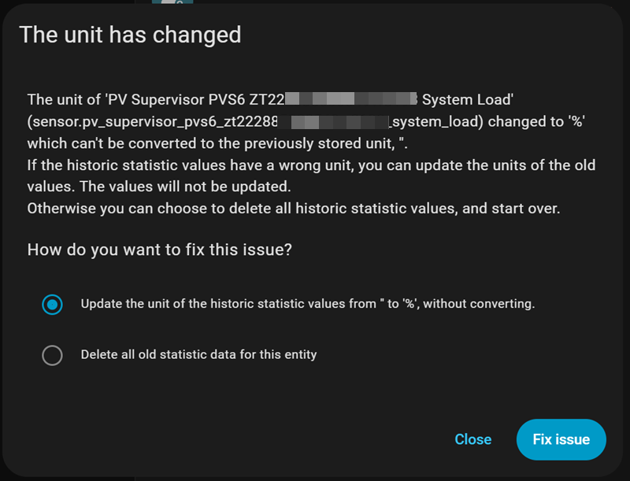

# Troubleshooting Guide

## Common Issues

### PVS Not Responding
1. **Check Network Connectivity**: Ensure PVS LAN port isolation is working properly
2. **Verify IP Address**: PVS typically uses `172.27.153.1`
3. **Monitor Health Checks**: Integration shows health check attempts in notifications
4. **Check Backoff Status**: Integration may be in cooldown period after failures
5. **Route Status**: If route checking enabled, verify route exists vs PVS down
6. **PVS Reboot**: If persistent, power cycle the PVS (turn off breaker for 60 seconds)

### 🛜 **Route Issues (VLAN/Custom Networks)**
1. **Enable Route Check**: Turn on automatic route checking in advanced settings
2. **Configure Gateway**: Set correct gateway IP for your network topology
3. **Monitor Route Alerts**: Watch for route missing vs PVS unreachable notifications
4. **Manual Route Check**: `ip route show 172.27.153.0/24` to verify route exists
5. **Test Route Setup/Repair**: Integration will automatically add missing routes

### ⚡ **Hardware/Power Issues (USB Setups)**
1. **Check Power Draw**: Measure combined USB device power consumption
2. **Single Adapter**: Use only one USB-Ethernet adapter per power source
3. **Dedicated Power**: Power USB adapters separately from Pi/computer
4. **Powered Hub**: Use quality powered USB hub rated for network adapters
5. **Cable Length**: Use shorter, thicker USB cables to minimize voltage drop
6. **Monitor Logs**: Check for USB disconnect messages in system logs

### Unit Change Notifications After Upgrade


**Expected Behavior**: Enhanced integration fixes unit inconsistencies from original.

**Recommended Action**: Click **"Update the unit of the historic statistic values"** to:
- ✅ Preserve all historical data
- ✅ Fix unit displays (shows proper % symbols)
- ✅ Improve HA statistics consistency

**Why This Happens**: Enhanced integration properly declares percentage units for sensors like "System Load" that previously had no units.

### All Entities Show "Unavailable" or Config UI Corrupted
1. **🌐 Force Browser Refresh**: **Ctrl+F5** (Windows) or **Cmd+Shift+R** (Mac) to clear cached files
2. **Check Integration Status**: Look for "Fresh data from PVS" notifications
3. **Verify Health Check**: Should see "PVS Health Check" notifications in debug mode
4. **Monitor Notifications**: Check for "PVS OFFLINE" or backoff messages
5. **Check PVS Response**: Try manual test: `curl http://172.27.153.1/cgi-bin/dl_cgi?Command=DeviceList`

### Diagnostic Sensors Not Working
1. **Check Device**: Look for "Enhanced SunPower Diagnostics" device
2. **Verify Sensors**: Should see 7 diagnostic sensors with real values
3. **Wait for Data**: Some sensors need a few polling cycles to show meaningful data
4. **Check Logs**: Look for diagnostic tracking messages in HA logs
5. **Time Display**: Verify "Last Successful Poll" shows readable format (e.g., "5 minutes ago")

### Inverter Health Alerts
1. **Individual Inverter Offline**: Check specific inverter mentioned in alert
2. **Multiple Inverter Issues**: May indicate PVS communication problems
3. **False Positive Alerts**: Verify inverter is actually producing power
4. **Recovery Notifications**: Normal when inverters come back online after maintenance

### Mobile Notifications Not Working
1. **Check Mobile App**: Ensure Home Assistant mobile app is installed and configured
2. **Verify Service Name**: Check that selected mobile service exists
3. **Test Notification**: Use HA Developer Tools to test mobile notification service
4. **Fallback Behavior**: Should automatically use persistent notifications if mobile fails

### Battery Data Missing
1. **Enable Battery System**: Check integration configuration options
2. **Verify SunVault Installation**: Ensure batteries are properly connected to PVS
3. **Check Notifications**: Look for battery detection warnings
4. **ESS Communication**: Battery data requires separate ESS API endpoint

### Sunrise/Sunset Elevation Issues
1. **Check Sun Entity**: Ensure `sun.sun` entity exists in Home Assistant
2. **Verify Configuration**: Review sunrise and sunset elevation settings (-10° to 45° allowed)
3. **Monitor Transitions**: Check day/night notifications for elevation values and which threshold is active
4. **Adjust Thresholds**: Fine-tune elevation based on your panel orientation and generation patterns
5. **Custom Values**: Try east-facing (5°/15°), west-facing (15°/5°), or balanced (10°/10°) presets

### 🕒 **Time Display Issues**
1. **Notification Format**: All time values should show human-readable format
2. **Cache Age**: Should display "50 minutes ago" instead of "3039s ago"
3. **Diagnostic Sensors**: "Last Successful Poll" should show readable time
4. **Consistency**: All notification channels should use same time formatting

## Network Setup Issues

### **Hardware Power Requirements & Known Issues**

**CRITICAL: PVS USB Power Limitation Warning**

Many users power their Raspberry Pi directly from the PVS USB ports. However, the PVS has **limited USB power capacity** that can cause **random connection drops** when exceeded:

**The Problem:**
- **PVS USB ports** have limited power output (exact specs unknown)
- **Dual USB-Ethernet setup** (WAN + LAN adapters) can exceed this capacity
- **Raspberry Pi Zero 2 W** alone can draw up to **1.5A**
- **USB-Ethernet adapters** add ~500-800mA each
- **Combined load** can exceed PVS USB power capacity

**Real-World Example:**
*Developer experienced random PVS connectivity issues using **two SunPower-approved USB-Ethernet adapters** (one for WAN, one for LAN) powered from PVS USB ports. Problem completely resolved by switching PVS back to WiFi for WAN connection, leaving only one USB-Ethernet adapter for LAN polling.*

**Symptoms of PVS USB Power Overload:**
- **Random "PVS OFFLINE" alerts** despite network functioning normally
- **Integration works fine for hours, then suddenly fails**
- **PVS becomes completely unresponsive** requiring power cycle
- **Both WAN and LAN connections drop randomly**

**Practical Solutions:**

**Recommended: Reduce USB Load**
- **Use WiFi for PVS WAN** connection (phoning home to SunPower)
- **Single USB-Ethernet adapter** for LAN polling only
- **Significantly reduces** PVS USB power draw
- **Fits within limited PVS enclosure space**

**Alternative: External Pi Power**
- **External power supply** for Raspberry Pi (don't use PVS USB for Pi power)
- **Note**: Space constraints in PVS enclosure make this challenging

**Important Notes:**
- **No PVS logs available** - you won't see USB disconnect messages
- **SunPower-approved hardware** can still exceed power limits in dual configuration
- **Random failures** are the primary symptom, not permanent connection loss
- **PVS newer models** often lack RJ45 jacks, requiring USB-Ethernet solutions

### Network Architecture Overview
```
Internet ──┐
           │
     Your Router/Switch
           │
    ┌──────┼──────┐
    │             │
PVS WAN Port   PVS LAN Port (172.27.153.1)
(SunPower      │
 Cloud)        └── Isolated Network → Home Assistant
```

### Community Solutions
The community has developed several proven approaches for PVS network isolation:

- **VLAN Isolation** (Recommended for managed switches) - **Auto route setup/repair supported**
- **Raspberry Pi Proxy** (Popular community solution)
- **Dedicated Network Interface** (Direct connection approach)

**For detailed network setup guidance**, see existing community resources and [@krbaker's documentation](https://github.com/krbaker/hass-sunpower#network-setup).

**Support Scope**: Network configuration is outside the scope of this integration. We provide general guidance but recommend consulting community network guides for detailed setup assistance.

## Debug Information
Enable debug notifications to monitor:
- Health check attempts and results
- Polling status and timing decisions
- Sunrise/sunset transitions with elevation values and active thresholds
- PVS response times and data quality
- Auto-recovery events and cache usage
- Individual inverter health status
- Mobile notification delivery status
- Route detection, setup, and repair activities
- Time conversion accuracy
